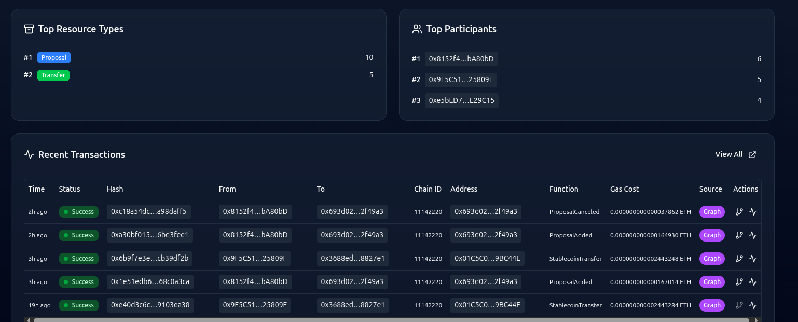
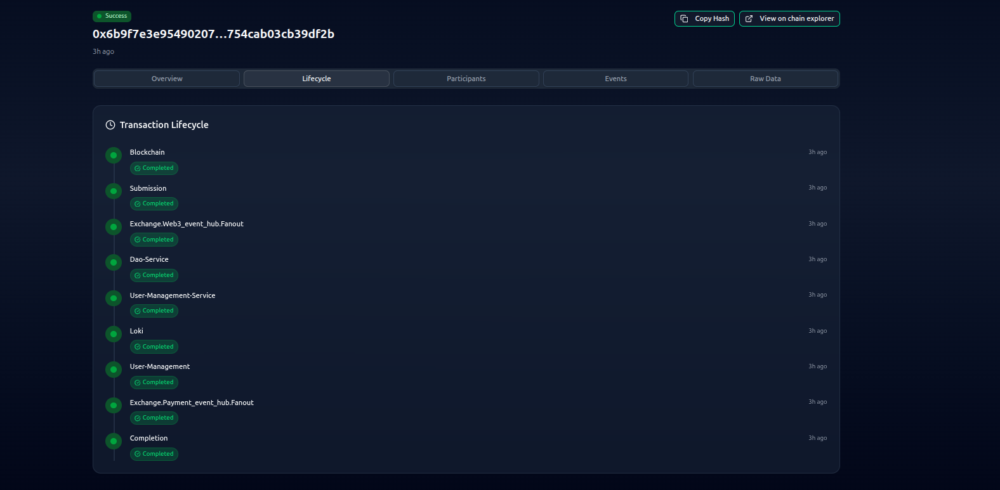

# FinCube - Privacy-Preserving B2B Financial Infrastructure for Enterprise Platforms

  
  
  **Made by Web3 Team - Brain Station 23 PLC**

---

## Executive Summary

FinCube is an enterprise-grade **real-time money movement and traceability platform** that enables organizations to execute instant, privacy-preserving B2B transfers using blockchain technology—without the complexity. Built on **Circle's USDC stablecoin**, FinCube combines Zero-Knowledge Proofs (ZKP), AI-powered fraud detection, and complete audit trails to deliver **secure, compliant, and transparent** financial operations in real-time.

### Key Capabilities

- **🔐 Privacy-Preserving Transfers**: Zero-knowledge proofs enable membership verification without revealing sensitive information
- **💰 USDC Stablecoin Integration**: Built on Circle's USDC, the world's leading digital dollar with over $40B in circulation
- **🌍 Real-Time Global Payments**: Instant cross-border transfers 24/7/365 with complete traceability
- **🔌 EVM Compatibility**: Plug-and-play support for any EVM-compatible blockchain (Ethereum, Polygon, Arbitrum, etc.)
- **📈 Unlimited Scalability**: Batch-based polynomial system supports unlimited users
- **📊 Complete Audit Trail**: Event-driven architecture with RabbitMQ integration for regulatory compliance
- **🛡️ Enterprise Security**: BN254 curve, Poseidon2 hashing, Honk proof system
- **🤖 AI-Powered Fraud Detection**: Real-time fraud analysis using K-NN and LLM-enhanced detection
- **⚡ On-Chain Verification**: All cross-organization transfers verified on blockchain

### Who Benefits from FinCube?

**Financial Institutions**
- Banks seeking instant cross-border settlement
- Payment processors requiring real-time reconciliation
- Remittance providers needing lower transaction costs

**Enterprise Organizations**
- Global e-commerce platforms with high payment volumes
- Supply-chain networks requiring multi-party payment automation
- Treasury departments managing cross-border liquidity

**Digital Asset Platforms**
- Centralized exchanges (CEX) needing secure custody and audit trails
- Institutional staking platforms requiring automated reward distribution
- DeFi protocols seeking enterprise-grade compliance

**Regulated Industries**
- Organizations requiring AML/CTF compliance
- Businesses needing complete transaction traceability
- Enterprises subject to regulatory audits and reporting

---

## The Challenge: Web3 Adoption Barriers

The digital economy is rapidly shifting toward Web3, offering unprecedented speed and transparency. However, traditional enterprises face significant obstacles:

- **Technical Complexity**: Blockchain technology requires specialized expertise
- **Compliance Hurdles**: Regulatory requirements are difficult to navigate
- **Fragmented Data**: Disconnected systems create reconciliation challenges
- **Integration Costs**: Replacing existing infrastructure is prohibitively expensive

**The Result**: Organizations miss out on the benefits of instant, low-cost global payments while competitors move ahead.

---

## The Solution: FinCube Platform

FinCube eliminates these barriers by providing a **standardized interface** that connects your existing Web2 systems to Web3 capabilities—without abandoning your current infrastructure.

### Core Value Proposition

**"Move money faster and in real-time by leveraging Web3, without being overwhelmed by its complexity."**

FinCube delivers:
- ✅ **Instant Settlement**: 24/7 global transfers in seconds, not days
- ✅ **Lower Costs**: Eliminate wire transfer fees and foreign exchange spreads
- ✅ **Complete Transparency**: End-to-end visibility of every transaction
- ✅ **Regulatory Compliance**: Built-in audit trails and compliance reporting
- ✅ **Privacy Protection**: Zero-knowledge proofs protect sensitive business information
- ✅ **Seamless Integration**: Plug-and-play connectivity with existing systems

---

## Why Circle's USDC?

FinCube is built on **Circle's USD Coin (USDC)**, the world's leading digital dollar:

### Market Leadership
- **$40+ Billion** in circulation globally
- **Highest transaction volume** among all stablecoins
- **Most trusted** by institutions and Fortune 500 companies
- **Available on 15+ blockchains** worldwide

### Trust & Stability
- **1:1 USD backing**: Every USDC is backed by cash and U.S. Treasury bonds
- **Monthly attestations**: Verified by Grant Thornton LLP
- **Regulated**: Circle is licensed under U.S. state regulations
- **Institutional grade**: Used by major banks and payment processors

### Business Benefits
- **Predictable Accounting**: Stable $1 value simplifies financial reporting
- **Instant Settlement**: Real-time transfers without 2-3 day delays
- **Global Reach**: Send payments anywhere, 24/7/365
- **Lower Costs**: Eliminate international wire fees ($25-$50+ per transfer)
- **Programmable**: Smart contracts enable automated workflows

---

## FinCube Platform: Four Core Services

### 1. Enterprise Onboarding & Legacy Integration

**Challenge**: Organizations can't afford to replace their existing financial systems.

**FinCube Solution**:
- **Plug-and-Play Connectivity**: Connect existing Web2 systems via APIs or managed dashboard
- **Cross-Organization Collaboration**: Map enterprise identity into Web3 governance (DAO)
- **Reconciliation Hub**: Automatic alignment between Web2 financial systems and blockchain operations
- **Zero Disruption**: Keep your current systems while gaining Web3 benefits

**Business Impact**: Onboard to blockchain in days, not months, without system replacement costs.

---

### 2. Custodian Wallet Platform

**Challenge**: Managing corporate treasury across multiple blockchains is complex and risky.

**FinCube Solution**:
- **Multi-Chain Custodian Wallet**: Secure organizational wallets across all major blockchains (Ethereum, Polygon, Arbitrum, etc.)
- **Unified Treasury Dashboard**: Real-time view of all corporate crypto assets in one place
- **Automated Reconciliation**: Matches off-chain execution with on-chain settlement automatically
- **Regulatory APIs**: Direct access for auditors and regulators

**Business Impact**: Manage corporate treasury with the same ease as traditional banking, with complete audit trails.

---

### 3. Complete Blockchain Traceability

**Challenge**: Lack of visibility into blockchain transactions creates audit and compliance risks.

**FinCube Solution**:
- **End-to-End Tracking**: Monitor deposits, withdrawals, swaps, staking, rewards, and transfers
- **Fault-Tolerant Monitoring**: Dual-source event detection ensures no transaction is missed
- **Real-Time Synchronization**: Instant updates to your Web2 systems
- **Regulatory-Aligned Data**: Transaction logs formatted for audit requirements

**Business Impact**: Complete visibility and control over all blockchain activities, meeting regulatory standards.

---

### 4. Compliance-First Auditing

**Challenge**: Regulatory compliance is the #1 barrier to blockchain adoption for enterprises.

**FinCube Solution**:
- **Verifiable Proof of Funds**: Complete lifecycle tracking from fiat on-ramp to off-ramp
- **Compliance-Ready Reporting**: Standardized logs aligned with AML, CTF, and KYC requirements
- **Real-Time Risk Detection**: AI-powered fraud detection with instant alerts
- **Regulator Alignment**: Evidence trails that support formal investigations

**Business Impact**: Move money instantly while fully satisfying all audit and regulatory requirements.

---

## Audit Trail Service: Complete Transparency

### Purpose
Plug-and-play module for recording and tracking all blockchain activities with fault-tolerant event detection.

### Current Capabilities
- **DAO Operations**: Track all governance activities and proposals
- **FinCube Transfers**: Monitor all payment transactions
- **Scalable Design**: Easily extends to any blockchain use case

### Technical Architecture
- **Blockchain Agnostic**: Works with any blockchain network
- **Dual-Source Monitoring**: Uses both Alchemy and TheGraph for 100% reliability
- **Real-Time Tracking**: Instant transaction history updates
- **Automatic Failover**: Ensures no events are missed
- **API Integration**: Direct connection with Kong API Gateway

### Key Features
- ✅ **Plug-and-Play**: Integrates into any dApp ecosystem
- ✅ **Fault-Tolerant**: Redundant event detection prevents data loss
- ✅ **Real-Time**: Instant synchronization with off-chain databases
- ✅ **Validation**: Automatic blockchain data verification
- ✅ **Event Publishing**: Notifies other microservices of activities

**Business Impact**: Complete audit trail for every transaction, meeting the highest regulatory standards.

---

## Privacy Protection: Zero-Knowledge Proofs

### The Privacy Challenge
Traditional blockchain transactions are public, exposing sensitive business information like:
- Trading partners and relationships
- Transaction volumes and patterns
- Organizational structure
- Financial strategies

### FinCube's Solution: Zero-Knowledge Proofs (ZKP)

**What It Does**:
- Proves membership and authorization **without revealing identity**
- Verifies transactions **without exposing amounts or parties**
- Maintains privacy **while ensuring compliance**

**How It Works** (Simplified):
1. Organizations create a cryptographic "membership list"
2. Members prove they're authorized without revealing who they are
3. Transactions are verified without exposing business relationships
4. Auditors can verify compliance without seeing sensitive data

**Business Benefits**:
- ✅ **Competitive Protection**: Keep trading relationships confidential
- ✅ **Strategic Privacy**: Protect financial strategies from competitors
- ✅ **Compliance**: Meet regulatory requirements without data exposure
- ✅ **Trust**: Cryptographic proof is more secure than traditional methods

---

## Governance: FinCubeDAO

FinCube operates under a **Decentralized Autonomous Organization (DAO)** ensuring democratic, transparent governance where member organizations collectively make decisions about platform economics, token support, and operational rules through on-chain voting.

**Business Impact**: Fair, transparent governance that protects all participants and builds trust through democratic decision-making.

---

## AI-Powered Fraud Detection

### Real-Time Risk Management

FinCube includes advanced fraud detection using artificial intelligence:

**Technology**:
- **44-Dimensional Analysis**: Examines transaction patterns, timing, values, and behaviors
- **K-NN Algorithm**: Compares transactions to known fraud patterns
- **LLM Enhancement**: Google Gemini AI provides intelligent analysis
- **Real-Time Alerts**: Instant notification of suspicious activities

**Detection Capabilities**:
- Unusual transaction patterns
- Anomalous transfer volumes
- Suspicious timing patterns
- High-risk address interactions
- Edge case scenarios

**Business Impact**: Protect your organization from fraud while maintaining fast transaction processing.

---

## Integration Standards: ISO & FDX Compliance

FinCube strictly adheres to global standards:

### ISO Standards
- **ISO 20022**: International standard for financial messaging
- **Structured Data**: Consistent format for all transactions
- **Global Compatibility**: Works with any compliant system

### Financial Data Exchange (FDX)
- **Standardized APIs**: Industry-standard data exchange protocols
- **Secure Access**: Bank-level security for data sharing
- **Regulatory Alignment**: Meets financial industry requirements

**Business Impact**: Seamless integration with existing enterprise systems without custom development.

---

## Use Cases: Who Benefits from FinCube?

### 1. Financial Institutions
**Challenge**: Slow international transfers, high fees, limited operating hours

**FinCube Solution**:
- Instant cross-border payments 24/7
- Reduce wire transfer costs by 95%
- Real-time settlement and reconciliation
- Complete audit trails for regulators

**ROI**: $25-50 saved per international transfer, 2-3 day settlement reduced to seconds

---

### 2. Global E-Commerce Platforms
**Challenge**: High payment processing fees, currency conversion costs, delayed settlements

**FinCube Solution**:
- Accept USDC payments globally
- Eliminate 2-3% credit card fees
- Instant settlement (no 2-3 day holds)
- Automated reconciliation

**ROI**: 2-3% savings on every transaction, improved cash flow

---

### 3. Supply Chain Networks
**Challenge**: Complex multi-party payments, reconciliation nightmares, fraud risks

**FinCube Solution**:
- Automated supplier payments
- Real-time tracking of all transactions
- Smart contract automation
- Complete transparency for all parties

**ROI**: Reduced reconciliation costs, faster supplier payments, fraud prevention

---

### 4. Institutional Staking Platforms
**Challenge**: Managing staking rewards, tracking yields, regulatory reporting

**FinCube Solution**:
- Automated reward distribution
- Real-time yield tracking
- Compliance-ready reporting
- Multi-chain support

**ROI**: Reduced operational overhead, improved client reporting

---

### 5. Centralized Exchanges (CEX)
**Challenge**: Custody risks, reconciliation complexity, regulatory scrutiny

**FinCube Solution**:
- Secure custodian wallets
- Automated trade-to-ledger reconciliation
- Complete audit trails
- Regulatory-aligned reporting

**ROI**: Reduced custody risks, simplified compliance, operational efficiency

---

## Comparison: Traditional vs FinCube

| Feature | Traditional Banking | FinCube + USDC |
|---------|-------------------|----------------|
| **Settlement Time** | 2-3 business days | Seconds |
| **Operating Hours** | Business hours only | 24/7/365 |
| **Transparency** | Limited visibility | Complete on-chain audit trail |
| **Reconciliation** | Manual, error-prone | Automated, real-time |
| **Compliance Reporting** | Manual compilation | Automated, standardized |
| **Fraud Detection** | Reactive | Real-time AI-powered |
| **Privacy** | Centralized trust | Cryptographic proof |
| **Integration** | Custom, expensive | Plug-and-play APIs |

---

## Security & Compliance

### Multi-Layer Security
- **Cryptographic Protection**: BN254 elliptic curve (128-bit security)
- **Smart Contract Audits**: Verified by security experts
- **Custodian Wallets**: Enterprise-grade key management
- **Access Controls**: Role-based permissions
- **Audit Trails**: Immutable transaction records

### Regulatory Compliance
- **AML/CTF**: Anti-money laundering and counter-terrorism financing
- **KYC**: Know Your Customer verification
- **ISO 20022**: International financial messaging standard
- **FDX**: Financial Data Exchange protocols
- **Audit-Ready**: Standardized reporting for regulators

### Privacy Protection
- **Zero-Knowledge Proofs**: Verify without revealing
- **Encrypted Communications**: End-to-end encryption
- **Data Minimization**: Only necessary data collected
- **GDPR Compliant**: European data protection standards

---

## Technology Advantages

### Multi-Chain Support
Works with USDC on all major blockchains:
- Ethereum
- Polygon
- Arbitrum
- Optimism
- Avalanche
- Base
- And more...

### Scalability
- **Unlimited Users**: Batch-based architecture scales infinitely
- **High Throughput**: Handles thousands of transactions per second
- **Global Reach**: Operates across all time zones simultaneously

### Reliability
- **99.9% Uptime**: Fault-tolerant architecture
- **Redundant Systems**: Dual-source event detection
- **Automatic Failover**: No single point of failure
- **24/7 Monitoring**: Continuous system health checks

---

## Business Model: DAO-Governed Economics

### Democratic Fee Structure

FinCube operates on a **decentralized governance model** where pricing and fee structures are determined democratically by member organizations through the DAO, rather than imposed by a central authority.

**How It Works**:
- **Member Voting**: All fee structures, transaction costs, and royalty amounts are decided through DAO proposals and voting
- **Fair Representation**: Each member organization has a voice in economic decisions
- **Transparent Process**: All fee changes require majority approval and are recorded on-chain
- **Flexible Adaptation**: Fee structures can evolve based on market conditions and member needs

**Organization Managed Economics**:
- ✅ **Transaction Fees**: Members vote on per-transaction costs
- ✅ **Royalty Structure**: Democratic decision on B2B currency swapping fees
- ✅ **Collateral Requirements**: Members define security requirements for token swaps
- ✅ **Fee Distribution**: Transparent allocation of collected fees
- ✅ **Volume Incentives**: Members can propose and vote on volume-based discounts

### Value Proposition

**Typical Enterprise Savings** (compared to traditional banking):
- **Wire Transfer Fees**: $25-50 per transfer → Minimal blockchain gas fees (95%+ savings)
- **Settlement Time**: 2-3 days → Seconds (improved cash flow)
- **Reconciliation Costs**: Manual labor → Automated (80% reduction)
- **Fraud Losses**: Reactive detection → Real-time prevention (50% reduction)
- **Compliance Costs**: Manual reporting → Automated (60% reduction)

**Example Impact**: Organization processing 1,000 international transfers/month
- **Traditional Cost**: $35,000/month in fees + $10,000 in labor = $45,000
- **FinCube Cost**: Minimal gas fees + $2,000 in labor = ~$3,000
- **Potential Monthly Savings**: ~$42,000 (93% reduction)
- **Potential Annual Savings**: ~$504,000

*Note: Actual costs depend on DAO-approved fee structures and blockchain gas prices*

### Benefits of DAO Governance

**For Member Organizations**:
- **Fair Economics**: No single entity controls pricing
- **Aligned Interests**: Fee structures benefit all members equally
- **Transparency**: All economic decisions are public and auditable
- **Flexibility**: Adapt to changing market conditions through voting
- **Ownership**: Members collectively own and govern the platform

**For the Ecosystem**:
- **Sustainable Growth**: Economic model evolves with the network
- **Market-Driven Pricing**: Fees reflect actual costs and member needs
- **Innovation Incentives**: Members can propose new economic models
- **Long-Term Stability**: Democratic governance prevents exploitation

---

## Key Benefits: Why Organizations Choose FinCube

### 1. **Eliminate Nostro Accounts**

**Traditional Challenge**: Banks and financial institutions must maintain nostro accounts (foreign currency accounts held in correspondent banks) to facilitate international transfers. These accounts:
- Lock up significant capital in idle balances
- Require complex reconciliation across multiple institutions
- Create counterparty risk with correspondent banks
- Incur maintenance fees and minimum balance requirements

**FinCube Solution**: 
- **Direct Settlement**: Transfer USDC directly between organizations without intermediary accounts
- **Capital Efficiency**: No need to pre-fund accounts in multiple currencies or locations
- **Instant Liquidity**: Access funds immediately without waiting for correspondent bank processing
- **Reduced Counterparty Risk**: Eliminate dependency on correspondent banking relationships

**Business Impact**: Free up millions in trapped capital, reduce operational complexity, and eliminate correspondent banking fees.

---

### 2. **End Deferred Settlement**

**Traditional Challenge**: Conventional payment systems rely on deferred settlement where:
- Transactions are batched and settled at end of day or T+2/T+3
- Funds are in limbo during settlement period
- Credit risk exists until final settlement
- Cash flow forecasting is complicated by settlement delays

**FinCube Solution**:
- **Real-Time Gross Settlement (RTGS)**: Every transaction settles immediately on blockchain
- **Instant Finality**: Funds are available to recipient within seconds
- **Zero Settlement Risk**: No exposure to counterparty default during settlement period
- **Predictable Cash Flow**: Know exactly when funds will be available

**Business Impact**: Improve working capital management, eliminate settlement risk, and enable just-in-time payments.

---

### 3. **Build Crypto Treasury**

**Emerging Opportunity**: Organizations can strategically build and manage digital asset treasuries using FinCube:

**Treasury Building Capabilities**:
- **Accumulate USDC**: Build reserves in stable, dollar-denominated digital assets
- **Multi-Chain Diversification**: Hold assets across multiple blockchains for redundancy
- **Yield Opportunities**: Potential to earn yield on idle USDC balances (future integration)
- **Strategic Positioning**: Prepare for the digital economy while maintaining stability

**Treasury Management Features**:
- **Unified Dashboard**: Real-time view of all crypto holdings across chains
- **Automated Reconciliation**: Seamless integration with traditional accounting systems
- **Regulatory Compliance**: Audit-ready reporting for crypto asset holdings
- **Secure Custody**: Enterprise-grade wallet security with multi-signature options

**Business Impact**: Position your organization for the digital economy, optimize treasury returns, and maintain strategic flexibility.

---

### 4. **Speed & Availability**
Move money in seconds, not days. Operate 24/7/365 without banking hours or weekend delays.

**Key Advantages**:
- Instant cross-border transfers
- No waiting for bank opening hours
- Weekend and holiday operations
- Real-time transaction confirmation

---

### 5. **Cost Efficiency**
Eliminate wire transfer fees, foreign exchange spreads, and reconciliation labor.

**Cost Reductions**:
- 95%+ savings on international transfer fees
- No foreign exchange markup (USDC is dollar-denominated)
- Automated reconciliation reduces labor costs by 80%
- No nostro account maintenance fees

---

### 6. **Complete Transparency**
End-to-end visibility into every transaction with immutable audit trails.

**Transparency Benefits**:
- Real-time transaction tracking
- Immutable blockchain records
- Complete audit trail from initiation to settlement
- Regulatory-ready reporting

---

### 7. **Regulatory Compliance**
Built-in compliance with automated reporting and audit trails.

**Compliance Features**:
- AML/CTF compliance built-in
- KYC verification integrated
- ISO 20022 messaging standard
- Automated regulatory reporting

---

### 8. **Privacy Protection**
Zero-knowledge proofs protect sensitive business information while maintaining compliance.

**Privacy Advantages**:
- Confidential trading relationships
- Protected transaction patterns
- Competitive strategy protection
- Compliance without data exposure

---

### 9. **Enterprise Security**
Bank-grade security with cryptographic protection and smart contract audits.

**Security Layers**:
- 128-bit cryptographic security
- Audited smart contracts
- Enterprise key management
- Multi-signature wallet support

---

### 10. **Seamless Integration**
Plug-and-play connectivity with existing Web2 systems—no replacement needed.

**Integration Benefits**:
- API-based connectivity
- No system replacement required
- ISO 20022 and FDX compliance
- Minimal disruption to operations

---

### 11. **Unlimited Scalability**
Grows with your business from hundreds to millions of transactions.

**Scalability Features**:
- Batch-based architecture
- Multi-chain support
- High throughput processing
- Global reach

---

### 12. **Trust & Stability**
Built on Circle's USDC, the world's most trusted digital dollar with $40B+ in circulation.

**Trust Factors**:
- 1:1 USD backing
- Monthly attestations
- Regulatory compliance
- Institutional adoption

---

### 13. **Democratic Governance**
Member-owned platform with fair, transparent decision-making through DAO.

**Governance Benefits**:
- Voice in platform economics
- Transparent fee structures
- Collective ownership
- Aligned incentives

---

### 14. **Future-Ready Innovation**
Stay ahead of competitors by adopting next-generation payment infrastructure.

**Innovation Advantages**:
- Early mover advantage
- Access to emerging DeFi opportunities
- Programmable money capabilities
- Strategic positioning for digital economy

---

## 📸 Application Screenshots

### Transfer Page

The transfer interface provides a seamless user experience for initiating secure, privacy-preserving token transfers between organizations.

**Key Features**:
- Real-time balance display
- Recipient reference number input with validation
- Amount input with token denomination
- Transfer confirmation with transaction details
- Instant transaction hash response

*The transfer page showing the intuitive interface for initiating USDC transfers with ZKP privacy*

---

### Per-Transaction Fraud Detection

Real-time AI-powered fraud detection analyzes each transaction using 44-dimensional feature vectors and K-NN similarity search enhanced with LLM reasoning.

**Detection Features**:
- 44-dimensional transaction analysis
- K-NN similarity scoring with 10 nearest neighbors
- Google Gemini LLM-enhanced decision making
- Visual risk indicators (Low, Medium, High)
- Detailed fraud probability scores
- Reasoning explanation for each assessment

*Real-time fraud detection showing risk assessment with detailed reasoning and confidence scores*

---

### Audit Trail Dashboard

The Audit Trail Service provides comprehensive transaction monitoring with dual-source verification (Alchemy + TheGraph) ensuring complete coverage of all blockchain activities.

**Audit Features**:
- Complete transaction history with timestamps
- Real-time event tracking
- Dual-source verification status
- Transaction status indicators
- Filter and search capabilities

 
 

*Audit Trail dashboard displaying real-time transaction monitoring with dual-source verification*

---

### Transaction Details in Audit Trail

Detailed transaction view provides complete information for regulatory compliance and forensic analysis.

**Transaction Details Include**:
- Transaction hash and block number
- Sender and receiver reference numbers
- Transfer amount and token details
- Gas usage and transaction costs
- Complete lifecycle of cross-system communication
- Memo/metadata
- Timestamp and confirmation status
- Event source (Alchemy/TheGraph)
- Cross-validation status

#### Transaction Overview Tab

*Transaction overview showing complete details including sender/receiver addresses, amount, gas costs, and contract information*

#### Transaction Lifecycle Tab

*Transaction lifecycle tracking showing the complete journey from blockchain submission through all microservices with completion timestamps*

**Key Features**:
- **Multi-Tab Interface**: Organized view with Overview, Lifecycle, Participants, Events, and Raw Data tabs
- **Real-Time Status**: Live updates showing transaction progression through the system
- **Dual-Source Verification**: Cross-validation between Alchemy and TheGraph data sources
- **Complete Audit Trail**: Every step tracked from blockchain to all consuming microservices
- **Blockchain Explorer Integration**: Direct links to view transactions on block explorers

---

### Kiro Usage During the Development Phrase

---

## Conclusion

**FinCube strips away the technical friction of blockchain adoption.**

With FinCube, enterprises gain the **speed of Web3** combined with the **control, security, and compliance** of traditional finance. By leveraging Circle's USDC stablecoin and adhering to ISO standards and FDX protocols, we provide a seamless bridge between your existing systems and the future of finance.

**The digital economy is moving to Web3. FinCube ensures you're not left behind.**

---

## Get Started

### Request a Demo
See FinCube in action with a personalized demonstration for your organization.

### Schedule a Consultation
Discuss your specific needs with our enterprise solutions team.

---

**FinCube: Secure, Compliant, Real-Time Web3 Integration**

*Built with Circle's USDC | Powered by Zero-Knowledge Proofs | Designed for Enterprise*

---

## About Brain Station 23 PLC

  

**Brain Station 23 PLC** is a leading technology company specializing in enterprise blockchain solutions, Web3 integration, and digital transformation services. Our Web3 Team brings together expertise in:

- **Blockchain Development**: Smart contracts, DeFi protocols, and Web3 infrastructure
- **Enterprise Integration**: Seamless connection between traditional systems and blockchain
- **Cryptographic Security**: Zero-knowledge proofs and advanced privacy solutions
- **Regulatory Compliance**: AML/KYC integration and audit-ready systems
- **AI & Machine Learning**: Fraud detection and predictive analytics

**FinCube** represents our commitment to making blockchain technology accessible and practical for enterprise adoption, bridging the gap between Web2 and Web3 with security, compliance, and ease of use.

### Contact Brain Station 23
- **Website**: [https://brainstation-23.com](https://brainstation-23.com)
- **Email**: info@brainstation-23.com
- **Location**: Dhaka, Bangladesh

---

**Made by Web3 Team - Brain Station 23 PLC**

*Built with ❤️ for privacy-preserving B2B financial infrastructure*

---

**Document Version**: 1.0  
**Last Updated**: November 26, 2025  
**Classification**: Business Overview - Non-Technical  
**Developed By**: Web3 Team - Brain Station 23 PLC
