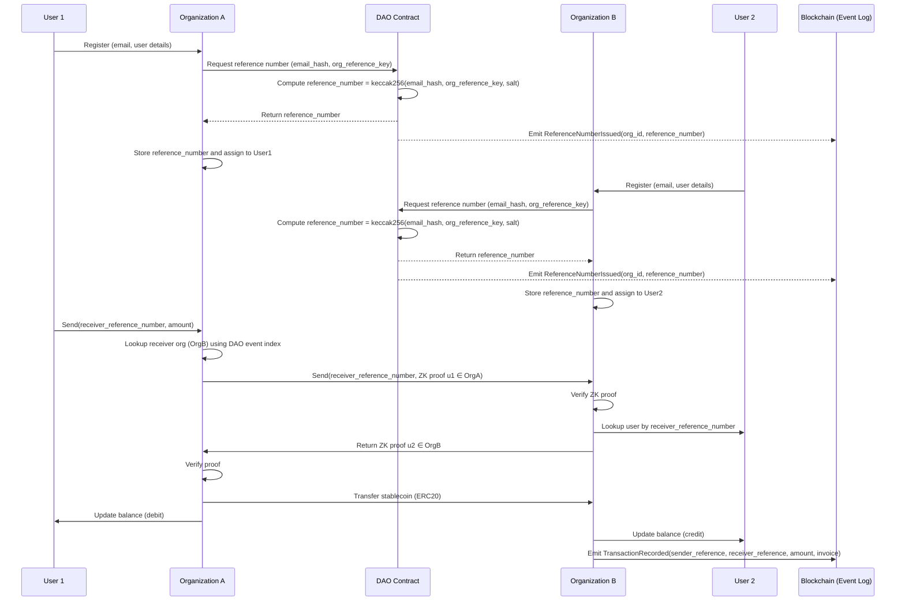
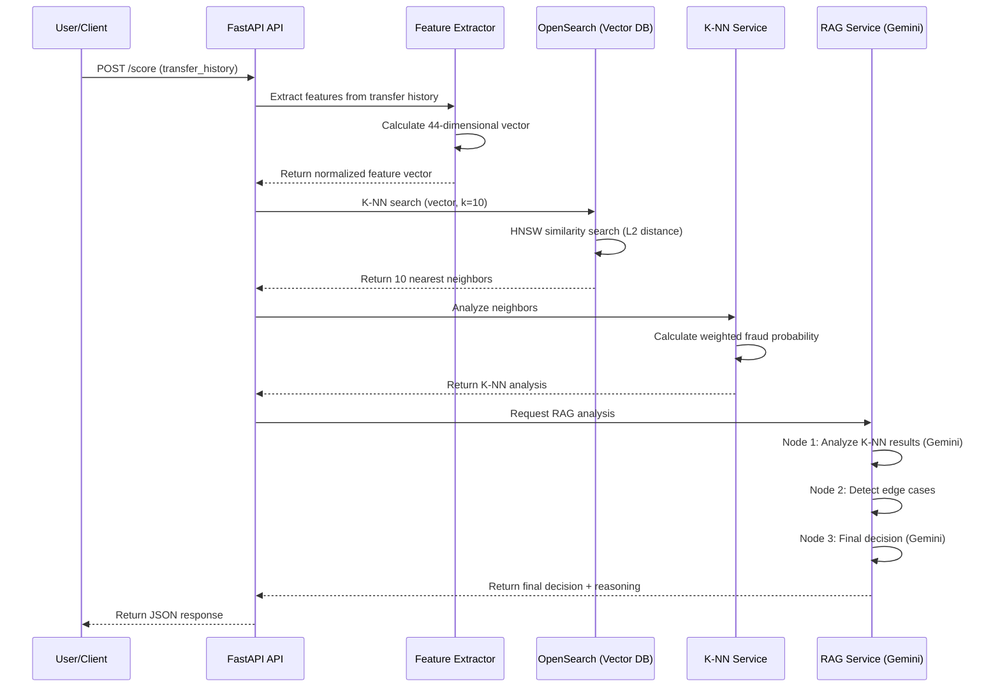

# FinCube - Privacy-Preserving B2B Financial Infrastructure for Enterprise Platforms

<div align="center">
  
  
  **Made by Web3 Team - Brain Station 23 PLC**
</div>

---

**FinCube** is an enterprise-grade, privacy-preserving financial infrastructure enabling secure B2B transfers using Zero-Knowledge Proofs (ZKP) and blockchain technology. Built on **Circle's USDC stablecoin**, FinCube provides instant, low-cost, transparent cross-border payments with enterprise-grade privacy and security.

The platform combines on-chain governance (FinCubeDAO), privacy-preserving transfers, AI-powered fraud detection, and a modern web interface to deliver next-generation B2B payment infrastructure.

## 🌟 Key Features

- **🔐 Privacy-Preserving Transfers**: Zero-knowledge proofs enable membership verification without revealing sensitive information
- **💰 USDC Stablecoin Integration**: Built on Circle's USDC, the world's leading digital dollar with over $40B in circulation and the highest transaction volume among stablecoins
- **🌍 Global Payment Infrastructure**: Leverages stablecoins as the emerging standard for worldwide payments and cross-border transfers
- **🔌 EVM Compatibility**: Plug-and-play support for any EVM-compatible blockchain (Ethereum, Polygon, Arbitrum, Celo, etc.)
- **📈 Scalable Architecture**: Batch-based polynomial system supports unlimited users
- **📊 Event-Driven Design**: RabbitMQ integration for audit trails and analytics
- **🛡️ Cryptographic Security**: BN254 curve, Poseidon2 hashing, Honk proof system
- **🤖 AI-Powered Fraud Detection**: Real-time fraud analysis using K-NN and LLM-enhanced detection
- **🎨 Modern Web Interface**: React-based frontend with real-time transaction tracking
- **⚡ On-Chain Verification**: All cross-organization transfers verified on blockchain

---

## 📋 Table of Contents

1. [System Architecture](#system-architecture)
2. [Core Components](#core-components)
3. [Transfer Flow](#transfer-flow)
4. [Zero-Knowledge Proof System](#zero-knowledge-proof-system)
5. [Smart Contracts](#smart-contracts)
6. [Fraud Detection](#fraud-detection)
7. [Frontend Application](#frontend-application)
8. [Getting Started](#getting-started)
9. [API Documentation](#api-documentation)
10. [Deployment](#deployment)
11. [Security & Privacy](#security--privacy)
12. [Documentation](#documentation)
13. [What's Implemented](#whats-implemented)
14. [Future Enhancements](#future-enhancements)
15. [Contributing](#contributing)
16. [Support & Resources](#support--resources)
17. [License](#license)

---

## 🏗️ System Architecture

### High-Level Overview

```
┌─────────────────────────────────────────────────────────────────────┐
│                         Client Applications                          │
│                    (Web, Mobile, API Consumers)                      │
└────────────────────────────┬────────────────────────────────────────┘
                             │
                             │ HTTPS/REST
                             ▼
┌─────────────────────────────────────────────────────────────────────┐
│                    Express.js API Gateway (Port 7000)                │
│  ┌──────────────┐  ┌──────────────┐  ┌──────────────┐             │
│  │   Transfer   │  │     Proof    │  │    Query     │             │
│  │  Controller  │  │  Controller  │  │  Controller  │             │
│  └──────────────┘  └──────────────┘  └──────────────┘             │
└────────────────────────────┬────────────────────────────────────────┘
                             │
        ┌────────────────────┼────────────────────┐
        │                    │                    │
        ▼                    ▼                    ▼
┌──────────────┐    ┌──────────────┐    ┌──────────────┐
│   MongoDB    │    │  EVM Chain   │    │   RabbitMQ   │
│              │    │  (Any EVM)   │    │              │
│ - Users      │    │              │    │ - Tx Events  │
│ - Orgs       │    │ - FinCube    │    │ - Audit      │
│ - Batches    │    │ - Verifier   │    │ - Analytics  │
│ - Events     │    │ - ERC20      │    │              │
└──────────────┘    └──────────────┘    └──────────────┘
        │                    │                    │
        └────────────────────┴────────────────────┘
                             │
                             ▼
                    ┌──────────────┐
                    │  ZKP System  │
                    │              │
                    │ - Noir       │
                    │ - Barretenberg│
                    │ - Poseidon2  │
                    └──────────────┘
```

### Technology Stack

**Backend**:
- Node.js 18+ with Express.js
- MongoDB + Mongoose ODM
- RabbitMQ (Event streaming)
- Ethers.js (EVM interaction)

**Frontend**:
- React 18.2.0 with TypeScript
- Vite 7.1.2 (Build tool)
- Zustand 5.0.8 (State management)
- GraphQL integration

**Blockchain**:
- Solidity smart contracts (FinCube, HonkVerifier)
- Any EVM-compatible RPC provider
- Circle's USDC stablecoin (primary integration)
- Support for additional ERC20 tokens

**Cryptography**:
- Noir (ZKP circuit language)
- Barretenberg (Proving backend)
- Poseidon2 (Hash function)
- BN254 elliptic curve

**AI/ML**:
- FastAPI (Python backend)
- OpenSearch (Vector database)
- Google Gemini (LLM analysis)
- K-NN fraud detection

---

## 🧩 Core Components

### 1. B2B Membership Service (`backend/b2b-membership/`)

The main application service that orchestrates transfers, manages users, and coordinates with blockchain.

**Key Features**:
- Transfer execution (same-org and cross-org)
- User and organization management
- Proof generation coordination
- Blockchain transaction execution
- Event publishing to RabbitMQ

### 2. ZKP Base System (`backend/base/`)

The cryptographic foundation providing zero-knowledge proof capabilities.

**Key Features**:
- Noir circuit definition
- Polynomial generation and evaluation
- Secret derivation (SHA-256 + BN254 field reduction)
- Proof generation (Barretenberg)
- Max polynomial degree: 128 (supports 128 users per batch)

### 3. Smart Contracts (`web3/contracts/`)

Solidity contracts deployed on EVM-compatible chains.

**Contracts**:
- **FinCubeDAO**: DAO contract for governance and membership management
- **FinCube**: Main transfer contract with ZKP verification
- **HonkVerifier**: On-chain proof verification

### 4. Fraud Detection Service (`sc_fraud_detection/`)

AI-powered fraud detection using machine learning and LLM analysis.

**Features**:
- Real-time address analysis
- 44-dimensional feature extraction
- K-NN similarity search
- LLM-enhanced decision making

### 5. Frontend Application (`frontend/`)

React-based web application for user interaction.

**Features**:
- User authentication and profile management
- Secure token transfers
- Transaction history with fraud detection
- Real-time balance tracking

### 6. Web3-Kit: Audit Trail Service

A mission-critical, plug-and-play microservice that provides enterprise-grade blockchain activity tracking and audit capabilities with guaranteed performance SLAs.

**Purpose**: 
- Track and index blockchain transactions related to business operations in an enterprise-grade manner
- Provide complete audit trails for regulatory compliance (AML/CTF, KYC)
- Enable real-time monitoring of DAO operations and FinCube transfers with low latency
- Scalable to any blockchain use case with 99.5% uptime guarantee

**Key Features**:
- **Real-Time Event Tracking**: Captures on-chain events with 
- **Fault-Tolerant Recovery**: Automatic reconciliation via The Graph every 30 seconds
- **Enterprise-Level Indexing**: Maintains off-chain database with only business-relevant transactions
- **Event-Driven Architecture**: Asynchronous Pub/Sub pattern for non-blocking user experience
- **At-Least-Once Delivery**: RabbitMQ guarantees no event loss with retry policy
- **Dual-Source Monitoring**: Alchemy RPC (real-time) + TheGraph (backfill) for 100% coverage
- **Background Processing**: Scheduled cron jobs (`*/30 * * * * *`) for missed transactions
- **Database Migrations**: TypeORM-based PostgreSQL schema management

**Technology Stack**:
- **NestJS**: Modern Node.js framework for scalable server-side applications
- **PostgreSQL + TypeORM**: Enterprise database with migration support (Port 5434)
- **Alchemy RPC**: Primary blockchain data provider for real-time events
- **TheGraph Protocol**: Secondary data source for redundancy and backfill
- **RabbitMQ**: Message queue with at-least-once delivery guarantee
- **Kong Gateway**: API gateway with RabbitMQ publisher plugin


**Current Implementations**:
- DAO governance activity tracking
- FinCube transfer monitoring
- Smart contract event detection
- Transaction receipt processing
- Cross-chain event aggregation

---

## 🔗 Web3-Kit Integration: Seamless Audit Trail

### Architecture Overview

FinCube's backend seamlessly integrates with the **Audit Trail Service** to provide comprehensive blockchain activity monitoring and regulatory compliance. This integration ensures that every transaction, governance action, and smart contract interaction is automatically tracked and auditable.

```
┌─────────────────────────────────────────────────────────────────────┐
│                         Frontend Application                         │
└────────────────────────────┬────────────────────────────────────────┘
                             │
                             │ HTTPS/REST
                             ▼
┌─────────────────────────────────────────────────────────────────────┐
│                      Kong API Gateway                                │
│                   (RabbitMQ Publisher Plugin)                        │
└────────────────────────────┬────────────────────────────────────────┘
                             │
        ┌────────────────────┼────────────────────┐
        │                    │                    │
        ▼                    ▼                    ▼
┌──────────────┐    ┌──────────────┐    ┌──────────────┐
│ B2B Backend  │    │ Audit Trail  │    │   RabbitMQ   │
│ (Port 7000)  │    │   Service    │    │   Broker     │
│              │    │ (NestJS)     │    │              │
│ - Transfers  │◄──►│              │◄──►│ - Events     │
│ - Proofs     │    │ - Tracking   │    │ - Queues     │
│ - Queries    │    │ - Validation │    │ - Exchanges  │
└──────────────┘    └──────────────┘    └──────────────┘
        │                    │                    │
        └────────────────────┼────────────────────┘
                             │
                             ▼
                    ┌──────────────┐
                    │  Blockchain  │
                    │              │
                    │ - Alchemy    │
                    │ - TheGraph   │
                    │ - Events     │
                    └──────────────┘
```

### Integration Components

#### 1. **Kong Gateway Integration**

**Purpose**: Captures on-chain transaction data directly from frontend requests

**How It Works**:
- Kong's `rabbitmq-publisher` plugin automatically publishes transaction events
- Every API call that results in blockchain interaction is tracked
- Events are published to RabbitMQ exchanges for processing
- No additional code required in frontend or backend

**Integration Characteristics**:
- Zero-configuration event capture through Kong Gateway's RabbitMQ publisher plugin
- Complete transaction coverage with at-least-once delivery guarantee via RabbitMQ
- Reliable delivery mechanism where Kong ensures event publishing even during temporary service unavailability
- Asynchronous processing model providing non-blocking user experience with immediate transaction hash response

**Why Event-Driven Architecture?**

Traditional synchronous approaches would force users to wait for blockchain confirmation (several seconds to minutes), creating poor user experience. FinCube's event-driven architecture solves this:

**The Problem**: Blockchain transactions require confirmation across multiple blocks, which can take significant time depending on network congestion and gas fees.

**The Solution**: Asynchronous Pub/Sub flow that provides instant user feedback while processing confirmations in the background.

**Flow**:
1. **User Action**: User initiates blockchain transaction
2. **Immediate Response**: Frontend receives transaction hash instantly - no waiting
3. **Background Processing**:
   - Audit Trail listens to RPC events in real-time
   - Missed events are backfilled via The Graph (every 30 seconds)
4. **Event Publishing**: When transaction is finalized on-chain:
   - Audit Trail publishes acknowledgement to RabbitMQ
   - All microservices update their off-chain databases asynchronously

**Result**: Users get instant feedback while the system maintains eventual consistency in the background, providing both excellent UX and data integrity.

#### 2. **Dual-Source Event Detection**

**Challenge**: Blockchain networks can be unreliable, and single data sources may miss events

**Solution**: Fault-tolerant monitoring using both Alchemy and TheGraph

**Architecture**:
```
Blockchain Events
       │
       ├─────────────────────────────────────┐
       │                                     │
       ▼                                     ▼
┌─────────────┐                    ┌─────────────┐
│   Alchemy   │                    │  TheGraph   │
│   Listener  │                    │   Listener  │
│             │                    │             │
│ - Real-time │                    │ - Indexed   │
│ - Direct    │                    │ - Reliable  │
│ - Fast      │                    │ - Queryable │
└─────────────┘                    └─────────────┘
       │                                     │
       └─────────────┬───────────────────────┘
                     │
                     ▼
            ┌─────────────────┐
            │ Event Validator │
            │                 │
            │ - Deduplication │
            │ - Verification  │
            │ - Enrichment    │
            └─────────────────┘
                     │
                     ▼
              ┌─────────────┐
              │  Database   │
              │   Storage   │
              └─────────────┘
```

**Automatic Failover**:
- If Alchemy is down → TheGraph continues monitoring
- If TheGraph is delayed → Alchemy provides real-time data
- Cross-validation ensures data accuracy
- No events are missed due to service outages

#### 3. **Event Processing Pipeline**

**Step 1: Event Capture**
```
Blockchain Transaction
       │
       ▼
┌─────────────────┐
│ Kong Gateway    │
│ RabbitMQ Plugin │
└─────────────────┘
       │
       ▼
┌─────────────────┐
│ RabbitMQ        │
│ Exchange        │
└─────────────────┘
```

**Step 2: Event Enrichment**
```
Raw Event Data
       │
       ▼
┌─────────────────┐
│ Audit Service   │
│ - Add metadata  │
│ - Validate data │
│ - Enrich context│
└─────────────────┘
```

**Step 3: Event Distribution**
```
Enriched Event
       │
       ├─────────────────────────────────────┐
       │                                     │
       ▼                                     ▼
┌─────────────┐                    ┌─────────────┐
│ Audit Trail │                    │ Analytics   │
│ Database    │                    │ Service     │
└─────────────┘                    └─────────────┘
       │                                     │
       ▼                                     ▼
┌─────────────┐                    ┌─────────────┐
│ Compliance  │                    │ Monitoring  │
│ Reporting   │                    │ Alerts      │
└─────────────┘                    └─────────────┘
```

### Tracked Activities

#### **FinCube Transfers**
- Transfer initiation and completion
- ZKP proof generation and verification
- Nullifier usage and validation
- Gas usage and transaction costs
- Cross-organization transfer details
- Same-organization optimizations

#### **DAO Operations**
- Member registration and approval
- Proposal creation and voting
- Governance parameter changes
- Fee structure updates
- Token approval decisions

#### **Smart Contract Events**
- Contract deployments and upgrades
- Function calls and state changes
- Event emissions and logs
- Error conditions and reverts

### API Integration

**Audit Trail Service Endpoint**: `/audit-trail-service`

**Key API Routes**:
```
GET  /audit-trail-service/transactions/:txHash
GET  /audit-trail-service/address/:address/history
GET  /audit-trail-service/dao/proposals
GET  /audit-trail-service/compliance/report
POST /audit-trail-service/events/validate
```

**Event Contract**:

The Audit Trail Service publishes standardized events following this schema:

```json
{
  "web3Status": 1,
  "message": "Transaction updated successfully.",
  "data": {
    "proposalId": 786,
    "proposalType": "External",
    "proposedWallet": "0xWaLlEt",
    "__typename": "EventName"
  },
  "blockNumber": 123456,
  "transactionHash": "0xtrx_hash"
}
```

**Event Naming Convention**:
- **Format**: `<network>.<contract_name>.<event_name>`
- **Style**: lowercase, snake_case
- **Example**: `sepolia.fincube.transfer_completed`

**Backend Integration Example**:
```javascript
// Automatic event publishing after transfer
const publishTransferEvent = async (transferData) => {
  const event = {
    type: 'FINCUBE_TRANSFER',
    timestamp: new Date().toISOString(),
    data: {
      transactionHash: transferData.txHash,
      from: transferData.sender,
      to: transferData.receiver,
      amount: transferData.amount,
      nullifier: transferData.nullifier,
      proofVerified: true
    }
  };
  
  // Published automatically via Kong Gateway
  // No manual RabbitMQ calls needed
  // Guaranteed delivery with at-least-once semantics
};
```

**RabbitMQ Exchange Configuration**:

| Parameter | Value |
|-----------|-------|
| **Exchange Type** | `fanout` |
| **Exchange Name** | `exchange.web3_event_hub.fanout` |
| **Delivery Guarantee** | At-least-once |
| **Queue Ownership** | Each service maintains its own dedicated queue |
| **Idempotency** | Required for duplicate event handling |

### Compliance Benefits

#### **Regulatory Reporting**
- **AML/CTF Compliance**: Complete transaction trails for anti-money laundering
- **KYC Verification**: Audit trail of member verification processes
- **Tax Reporting**: Detailed transaction history for tax compliance
- **Regulatory Audits**: Ready-to-submit audit reports

#### **Real-Time Monitoring**
- **Fraud Detection**: Immediate alerts for suspicious activities
- **Operational Monitoring**: System health and performance tracking
- **Compliance Violations**: Automatic detection of policy breaches
- **Risk Management**: Real-time risk assessment and mitigation

#### **Data Integrity**
- **Immutable Records**: Blockchain-backed audit trails
- **Cross-Validation**: Multiple data sources ensure accuracy
- **Tamper-Proof**: Cryptographic verification of all records
- **Complete Coverage**: No transaction goes untracked

### Scalability Features

#### **Horizontal Scaling**
- **Microservice Architecture**: Independent scaling of audit components
- **Load Balancing**: Distribute event processing across multiple instances
- **Queue Management**: RabbitMQ handles high-volume event streams
- **Database Sharding**: Partition audit data for performance

#### **Multi-Blockchain Support**
- **Chain Agnostic**: Works with any EVM-compatible blockchain
- **Unified Interface**: Single API for all blockchain networks
- **Cross-Chain Tracking**: Monitor activities across multiple chains
- **Network Failover**: Automatic switching between blockchain providers

### Business Impact

**For Organizations**:
- Regulatory compliance meeting all audit and reporting requirements
- Risk management through real-time monitoring and fraud detection
- Operational efficiency via automated audit trail generation
- Cost reduction eliminating manual compliance processes

**For Regulators**:
- Complete transparency providing full visibility into all transactions
- Real-time access with immediate availability of audit data
- Standardized reporting using consistent audit trail format
- Fraud prevention through proactive detection of suspicious activities

**For Developers**:
- Plug-and-play integration requiring no code changes for audit functionality
- Comprehensive APIs providing rich set of audit and compliance endpoints
- Event-driven architecture reacting to blockchain events with ≤3 second latency
- Scalable architecture handling enterprise-scale transaction volumes
- SLA-backed service with 99.5% uptime and defined performance guarantees
- Database migrations using TypeORM-based PostgreSQL schema management

### Service Level Agreement (SLA)

The Audit Trail Service operates under a comprehensive SLA to ensure enterprise-grade reliability.

**Service Dependencies**:
- **Alchemy RPC Nodes**: Live blockchain event streaming
- **The Graph Protocol**: Querying missed/pending transactions
- **RabbitMQ Broker**: Event distribution infrastructure

> **Note**: Service uptime and performance are dependent on third-party providers. The Audit Trail Service includes fault-tolerant mechanisms (retry logic, cron-based reconciliation), but cannot guarantee SLA compliance during third-party outages.

---

## 🔄 Transfer Flow

### Complete Transfer Sequence

The following diagram illustrates the complete flow from user registration to cross-organization transfer:



### Transfer Execution Flow

The system executes privacy-preserving transfers with the following steps:

```
1. [STEP 1/7] Validate Input
2. [STEP 2/7] Retrieve User Data
3. [STEP 3/7] Generate ZKP Proof (receiver membership)
4. [STEP 4/7] Generate Nullifier (unique tx ID)
5. [STEP 5/7] Create Memo (transfer metadata)
6. [STEP 6/7] Execute Blockchain Transfer
7. [STEP 7/7] Publish to RabbitMQ
8. Update Database Balances
```

**Key Characteristics**:
- 🔐 Cryptographically secure with ZKP
- ⛓️ On-chain verification via smart contracts
- 📝 Complete audit trail through RabbitMQ
- 🔒 Privacy-preserving membership verification
- 💸 Gas-efficient proof verification
- 🌐 Works on any EVM-compatible blockchain

---

## 🔐 Zero-Knowledge Proof System

### Core Concept

**Polynomial Membership Proof**:
1. Organization creates a polynomial where member secrets are roots
2. User proves they know a secret that evaluates to zero on the polynomial
3. Proof reveals nothing about the user's identity or other members

### Cryptographic Components

#### Secret Generation
```
User Secret = SHA-256(zkp_key || org_salt) mod BN254_FIELD_PRIME
```

#### Polynomial Structure
```
P(x) = c₀ + c₁x + c₂x² + ... + c₁₂₈x¹²⁸
```

**Properties**:
- Maximum degree: 128 (supports 128 members per batch)
- Coefficients: BigInt strings stored in MongoDB
- Evaluation: P(secret) = 0 for valid members

#### Nullifier Generation
```
Nullifier = Poseidon2(secret, verifier_key)
```

### Scalability: Batch System

**Challenge**: Polynomial degree limited to 128

**Solution**: Multiple independent batches

```
Organization
├── Batch 1 (Polynomial P₁) → Users 1-128
├── Batch 2 (Polynomial P₂) → Users 129-256
├── Batch 3 (Polynomial P₃) → Users 257-384
└── Batch N (Polynomial Pₙ) → Users ...
```

---

## 💰 USDC Stablecoin Integration

FinCube is built on **Circle's USD Coin (USDC)**, the world's leading digital dollar:

- **$40+ Billion** in circulation globally
- **1:1 USD backing** with monthly attestations by Grant Thornton LLP
- **Available on 15+ blockchains** (Ethereum, Polygon, Arbitrum, etc.)
- **Regulated** by U.S. state money transmitter licenses
- **Institutional grade** - used by major financial institutions and Fortune 500 companies

For detailed business benefits and value propositions, see [PROJECT_DESCRIPTION.md](./PROJECT_DESCRIPTION.md).

---

## 📜 Smart Contracts

### FinCubeDAO Contract

**Purpose**: Governance and membership management

**Key Features**:
- **Upgradeable** via UUPS (`UUPSUpgradeable`, `OwnableUpgradeable`, `ReentrancyGuardUpgradeable`)
- **Members**: `registerMember`, on execution of a `NewMemberProposal` the DAO approves members
- **Governance parameters**: `setVotingDelay(seconds)`, `setVotingPeriod(seconds)`
- **Proposals**:
  - `newMemberApprovalProposal(address, description)`
  - `propose(address[] targets, uint256[] values, bytes[] calldatas, string description)`
- **Voting**: `castVote(proposalId, support)` with a simple majority threshold `ceil(memberCount/2)`
- **Execution**: `executeProposal(proposalId)` after `voteEnd` and with sufficient `yesvotes`
- **Reference Number Generation**: `generateReferenceNumber(emailHash, orgReferenceKey)` - Creates unique user identifiers

### FinCube Contract

**Purpose**: Main transfer contract with ZKP verification

**Key Function**:
```solidity
function safeTransfer(
    address to,
    uint256 amount,
    string calldata memo,
    bytes32 nullifier,
    bytes32 sender_reference_number,
    bytes32 receiver_reference_number,
    bytes calldata receiver_proof,
    bytes32[] calldata receiver_publicInputs
) external
```

**Features**:
- ✅ Verifies receiver's ZKP proof via HonkVerifier
- ✅ Checks nullifier uniqueness (prevents double-spending)
- ✅ Transfers Circle's USDC stablecoin (or any approved ERC20 token)
- ✅ Emits transfer events for audit trail
- ✅ Supports memo for transaction metadata (ISO:20022 standard)
- ✅ Multi-chain support: Works with USDC on Ethereum, Polygon, Arbitrum, and more
- **Upgradeable** (UUPS) with upgrades authorized **only by the DAO**

### HonkVerifier Contract

**Purpose**: On-chain ZKP proof verification

**Key Function**:
```solidity
function verify(
    bytes calldata proof,
    bytes32[] calldata publicInputs
) external view returns (bool)
```

---

## 🤖 Fraud Detection

### AI-Powered Analysis

The fraud detection service uses advanced machine learning techniques:

**Feature Extraction**: 44-dimensional vectors including:
- Transaction metrics (counts, values, timing)
- Address patterns (unique addresses, contract interactions)
- ERC20 token behavior
- Balance and volume ratios

**K-NN Analysis**: 
- HNSW algorithm for similarity search
- Weighted fraud probability calculation
- Confidence scoring based on neighbor agreement

**LLM Enhancement**:
- Google Gemini for pattern analysis
- Edge case detection
- Reasoning generation

### Fraud Detection Flow



---

## 🎨 Frontend Application

### Features

- **User Authentication**: Email/password authentication with JWT tokens
- **Token Transfers**: Same-org and cross-org transfers with real-time balance updates
- **Transaction History**: GraphQL integration with The Graph subgraph
- **Fraud Detection**: Real-time analysis with visual risk indicators
- **User Profile**: Account information, balance display, reference number management

### Technology Stack

- React 18.2.0 with TypeScript
- Vite 7.1.2 (Build tool)
- Zustand 5.0.8 (State management)
- Ethers.js 5.7.2 (Blockchain interaction)
- React Router DOM 6.22.3

### Quick Start

```bash
cd frontend
yarn install
cp .env.example .env
# Edit .env with your configuration
yarn dev
```

---

## 🚀 Getting Started

### Prerequisites

- Node.js 18+
- MongoDB
- RabbitMQ
- Python 3.8+ (for fraud detection)
- Yarn package manager
- EVM-compatible RPC endpoint (Alchemy, Infura, etc.)

### Quick Setup

1. **Clone the repository**:
   ```bash
   git clone <repository-url>
   cd transferPoC
   ```

2. **Backend Setup**:
   ```bash
   cd backend/b2b-membership
   npm install
   cp .env.example .env
   # Edit .env with your configuration
   docker-compose up -d  # Start MongoDB and RabbitMQ
   npm start
   ```

3. **Frontend Setup**:
   ```bash
   cd frontend
   yarn install
   cp .env.example .env
   # Edit .env with your configuration
   yarn dev
   ```

4. **Fraud Detection Setup**:
   ```bash
   cd sc_fraud_detection
   pip install -r requirements.txt
   cp .env.example .env
   # Edit .env with your configuration
   python main.py
   ```

### Environment Configuration

**Backend (.env)**:
```env
# RPC Provider (Any EVM-compatible endpoint)
ALCHEMY_URL=https://your-network-rpc-endpoint
CHAIN_ID=1  # Auto-detected if not specified

# Smart Contracts
HONK_VERIFIER_CONTRACT_ADDRESS=0x...
FINCUBE_CONTRACT_ADDRESS=0x...

# USDC Token Address (varies by network)
# Ethereum Mainnet: 0xA0b86991c6218b36c1d19D4a2e9Eb0cE3606eB48
# Polygon: 0x2791Bca1f2de4661ED88A30C99A7a9449Aa84174
# Arbitrum: 0xFF970A61A04b1cA14834A43f5dE4533eBDDB5CC8
USDC_TOKEN_ADDRESS=0x...

# Wallet
WALLET_PRIVATE_KEY=your_private_key

# MongoDB
MONGODB_URI=mongodb://localhost:27017/b2b-membership

# RabbitMQ
RABBITMQ_HOST=localhost
RABBITMQ_PORT=5672
RABBITMQ_USERNAME=guest
RABBITMQ_PASSWORD=guest
```

**USDC Contract Addresses by Network**:
- **Ethereum**: `0xA0b86991c6218b36c1d19D4a2e9Eb0cE3606eB48`
- **Polygon**: `0x2791Bca1f2de4661ED88A30C99A7a9449Aa84174`
- **Arbitrum**: `0xFF970A61A04b1cA14834A43f5dE4533eBDDB5CC8`
- **Optimism**: `0x7F5c764cBc14f9669B88837ca1490cCa17c31607`
- **Avalanche C-Chain**: `0xB97EF9Ef8734C71904D8002F8b6Bc66Dd9c48a6E`
- **Base**: `0x833589fCD6eDb6E08f4c7C32D4f71b54bdA02913`

For complete list, visit: [Circle's USDC Documentation](https://developers.circle.com/stablecoins/docs/usdc-on-main-networks)

---

## 📚 API Documentation

### Transfer API

**POST /api/transfer**
```json
{
  "receiver_reference_number": "0x1234...5678_uuid",
  "amount": 100,
  "sender_user_id": 2001
}
```

### Query API

**GET /api/query/user/:user_id**
- Retrieve user with populated batch and organization

**GET /api/query/organization/:org_id**
- Retrieve organization with all associated users

### Proof API

**POST /api/proof/generate**
- Generate ZKP proof for membership verification

**POST /api/proof/verify**
- Verify proof against on-chain contract

### Health Check

**GET /health**
```json
{
  "status": "ok",
  "service": "zkp-proof-controller",
  "database": "connected",
  "rabbitmq": {
    "consumer": "connected",
    "publisher": "connected"
  }
}
```

For complete API documentation, see:
- [Backend API Usage](./backend/b2b-membership/API_USAGE.md)
- [Backend Documentation](./backend/BACKEND_DOCUMENTATION.md)
- [Frontend Documentation](./frontend/FRONTEND_DOCUMENTATION.md)

---

## 🚀 Deployment

### EVM Chain Deployment

**FinCube is EVM-Agnostic**: Deploy to any EVM-compatible blockchain without code modifications.

**Supported Networks** (Examples):
- Ethereum (Mainnet, Sepolia, Goerli)
- Polygon (Mainnet, Mumbai)
- Arbitrum (One, Goerli)
- Optimism (Mainnet, Goerli)
- Avalanche (C-Chain, Fuji)
- BSC (Mainnet, Testnet)
- Celo (Mainnet, Alfajores, Sepolia)
- Base (Mainnet, Goerli)
- Any EVM-compatible chain

### Deploying (UUPS proxies)

You **must** use proxy deployment for upgradeable contracts. Do **not** call `initialize` on implementation contracts.

### Remix + ERC1967Proxy

1. **Deploy FinCubeDAO (implementation)** — do nothing else with it.
2. **Encode init data** for DAO:
   - function: `initialize(string _daoURI, string _ownerURI)`
   - use Remix’s ABI encoder or `web3.eth.abi.encodeFunctionCall`.
3. **Deploy ERC1967Proxy** with:
   - `_logic` = DAO implementation
   - `_data`  = encoded init data
   - resulting address is **DAO proxy**
4. **Deploy FinCube (implementation)** — do nothing else with it.
5. **Encode init data** for FinCube:
   - function: `initialize(address _dao, address _token)`
   - `_dao` = **DAO proxy** address, `_token` = initial ERC‑20 (or `0x0`)
6. **Deploy ERC1967Proxy** for FinCube with its init data — resulting address is **FinCube proxy**.


## Governance parameters

Before proposing/voting, set timing:

```solidity
DAO.setVotingDelay(0);           // for quick testing
DAO.setVotingPeriod(120);        // e.g., 2 minutes
```

Voting is allowed when `now > voteStart && now < voteEnd`, execution requires `now ≥ voteEnd` and majority `yesvotes ≥ proposalThreshold()`.

---

## Proposals

### Propose: update the approved ERC‑20 on FinCube

- **Target**: FinCube **proxy** address
- **Value**: `0`
- **Calldata**: encoded `setApprovedERC20(address)`

**Remix inputs (strict JSON):**
```json
{
  "targets": ["0xFinCubeProxy..."],
  "values": [0],
  "calldatas": ["0x314b6256…"],
  "description": "Update approved ERC20"
}
```

**Solidity encoding:**
```solidity
bytes memory data = abi.encodeWithSignature(
    "setApprovedERC20(address)",
    0xYourNewToken...
);
```

**Safer (0.8.12+):**
```solidity
bytes memory data = abi.encodeWithSelector(FinCube.setApprovedERC20.selector, 0xYourNewToken...);
// or: abi.encodeCall(FinCube.setApprovedERC20, (0xYourNewToken...));
```

**ethers v6:**
```js
const iface = new ethers.Interface([
  "function setApprovedERC20(address newToken)"
]);
const calldata = iface.encodeFunctionData("setApprovedERC20", [newToken]);
```

> Ensure you pass `calldatas` as an **array of quoted hex strings** in Remix.

### Voting and execution
1. **Propose** as a member.
2. **Vote** during the window (`now > start && now < end`).
3. After `voteEnd`, call **`executeProposal(proposalId)`**. The DAO will:
   - for `GeneralProposal`: `Address.functionCall(target, data)`
   - for `NewMemberProposal`: call `approveMember(...)` internally

---

## Using `safeTransfer`

1. Ensure **FinCube.approvedERC20** is set (initially in `initialize` or via a DAO proposal).
2. The **`from`** account must approve the FinCube proxy on the ERC‑20:
   - `approve(FinCubeProxy, amount)`
3. Call `safeTransfer(from, to, amount, memo)` with **Value = 0**. Requirements:
   - `msg.sender` is an approved member
   - `from` and `to` are approved members
   - `memo` is in JSON format following ISO:20022 standard. It will be used for on-ramping and off-ramping.
   - `allowance(from, FinCube) ≥ amount` and `balanceOf(from) ≥ amount`

**Common reverts & causes**
- `Caller/From/To not member` — register + approve in DAO first.
- `Insufficient allowance` — run `approve` from the **from** account.
- `Insufficient balance` — top up the **from** account.
- `Only DAO` — attempting to call DAO‑only functions (`setApprovedERC20`, `setDAO`).
- `DAO not set` / `Token not set` — check `initialize` input and/or proposals.

---

## Events

**FinCubeDAO**
- `MemberRegistered(address newMember, string memberURI)`
- `MemberApproved(address member)`
- `ProposalAdded(ProposalType, uint256 proposalId, bytes data)`
- `ProposalCreated(...)`
- `VoteCast(address voter, uint256 proposalId, uint8 support, uint256 weight, string reason)`
- `ProposalExecuted(uint256 proposalId)`
- `ProposalCanceled(uint256 proposalId)`

**FinCube**
- `DAOUpdated(address newDAO)`
- `ApprovedERC20Updated(address newToken)`
- `StablecoinTransfer(address from, address to, uint256 amount, string memo)`


---


---

## 🛡️ Security & Privacy

### Privacy Guarantees

**Zero-Knowledge Proofs**:
- ✅ No membership information revealed
- ✅ Proofs cannot be linked to specific users
- ✅ Organization structure remains private
- ✅ Forward secrecy (past proofs valid after member removal)

**Cryptographic Security**:
- ✅ BN254 elliptic curve (128-bit security)
- ✅ Poseidon2 hash function (zk-SNARK optimized)
- ✅ Honk proof system (efficient verification)
- ✅ Nullifiers prevent double-spending

### Attack Resistance

**Verification Caching**:
- Nullifiers prevent redundant verification overhead
- Cached verifications reduce on-chain costs
- Unique per (user, verifier) pair

**Polynomial Integrity**:
- Hash commitments ensure data authenticity
- On-chain verification of polynomial hash
- Prevents polynomial tampering

**Replay Attack Prevention**:
- Nullifiers stored on-chain
- Duplicate nullifiers rejected
- Transaction uniqueness guaranteed

### Security Best Practices

**Smart Contract Security**:
- **Execution timing**: execution requires `now ≥ voteEnd`. Voting requires `now > voteStart && now < voteEnd`
- **Threshold stability**: current threshold is computed as `(memberCount + 1) / 2` at execution time
- **Reentrancy**: token transfers use `SafeERC20` and `nonReentrant` guards
- **Proxies**: Never call state‑changing functions on implementation contracts; storage lives in the proxies
- **`bytesToAddress` usage**: use the provided `toBytes(address)` helper when creating `NewMemberProposal` data

**Private Key Management**:
- Never commit private keys to version control
- Use environment variables for sensitive data
- Consider hardware wallets for production
- Implement key rotation policies

**API Security**:
- Input validation on all endpoints
- Rate limiting to prevent abuse
- HTTPS/TLS for all communications
- Authentication and authorization

---

## 📖 Documentation

### Core Documentation

**Backend**:
- [Backend Documentation](./backend/BACKEND_DOCUMENTATION.md) - Complete backend system overview
- [B2B Membership API Usage](./backend/b2b-membership/API_USAGE.md) - API reference
- [RabbitMQ Transaction Events](./backend/b2b-membership/RABBITMQ_TRANSACTION_EVENTS.md) - Event integration
- [ZKP Base System](./backend/base/README.md) - ZKP system overview

**Frontend**:
- [Frontend Documentation](./frontend/FRONTEND_DOCUMENTATION.md) - Complete frontend guide
- [Authentication Flow](./frontend/AUTH_FLOW.md) - Authentication details
- [Docker Integration](./frontend/DOCKER_AUTH_INTEGRATION.md) - Docker setup

**Smart Contracts**:
- [FinCube Contract](./web3/contracts/FinCube.sol) - Main transfer contract
- [FinCubeDAO Contract](./web3/contracts/FinCubeDAO.sol) - Governance contract

**Fraud Detection**:
- [Architecture Documentation](./sc_fraud_detection/ARCHITECTURE.md) - System architecture
- [Quick Start Guide](./sc_fraud_detection/QUICKSTART.md) - Getting started
- [Usage Examples](./sc_fraud_detection/USAGE_EXAMPLES.md) - API examples

### Architecture Diagrams

- [Transfer Flow Diagram](./SD-ZK-Integrated-Transfer.md) - Complete transfer sequence

---

## 🎯 What's Implemented

### ✅ Core Features

- **User Registration & Authentication**: Complete user management with JWT tokens
- **Reference Number System**: On-chain reference number generation via DAO contract
- **USDC Stablecoin Integration**: Native support for Circle's USDC across multiple blockchains
- **Privacy-Preserving Transfers**: Cross-organization transfers with blockchain verification and ZKP privacy
- **Zero-Knowledge Proofs**: Polynomial-based membership verification
- **Smart Contract Integration**: FinCube and FinCubeDAO deployed and operational
- **Multi-Chain Support**: Works with USDC on Ethereum, Polygon, Arbitrum, and other EVM chains
- **Event-Driven Architecture**: RabbitMQ integration for transaction events
- **Fraud Detection**: AI-powered fraud analysis with K-NN and LLM
- **Web Interface**: React frontend with transaction history and fraud indicators
- **GraphQL Integration**: The Graph subgraph for transaction queries

### ✅ Security Features

- **ZKP Privacy**: Membership verification without revealing identity
- **Nullifier System**: Prevents double-spending and replay attacks
- **Polynomial Batching**: Scalable to unlimited users
- **On-chain Verification**: HonkVerifier contract validates proofs
- **Audit Trail**: Complete transaction logging via RabbitMQ

### ✅ Infrastructure

- **EVM Compatibility**: Works with any EVM-compatible blockchain
- **MongoDB**: User, organization, and batch data storage
- **RabbitMQ**: Event streaming and audit logging
- **OpenSearch**: Vector database for fraud detection
- **Docker Support**: Containerized deployment

---

## 🤝 Contributing

We welcome contributions! Please follow these guidelines:

### Development Workflow

1. Fork the repository
2. Create a feature branch (`git checkout -b feature/amazing-feature`)
3. Make your changes
4. Run tests
5. Commit your changes (`git commit -m 'Add amazing feature'`)
6. Push to the branch (`git push origin feature/amazing-feature`)
7. Open a Pull Request

### Testing

```bash
# Backend tests
cd backend/b2b-membership
node run-all-tests.js

# Frontend tests
cd frontend
yarn test

# Fraud detection tests
cd sc_fraud_detection
pytest
```

---

## 📞 Support & Resources

### Getting Help

- **Documentation**: Review the comprehensive documentation in each component directory
- **Issues**: Open an issue on GitHub for bugs or feature requests
- **Discussions**: Join community discussions for questions and ideas

### External Resources

- [React Documentation](https://react.dev/)
- [Ethers.js Documentation](https://docs.ethers.org/)
- [Noir Documentation](https://noir-lang.org/)
- [The Graph Documentation](https://thegraph.com/docs/)
- [OpenZeppelin Contracts](https://docs.openzeppelin.com/contracts/)

---

## 📄 License

MIT License - see LICENSE file for details

---

## 👥 About Brain Station 23 PLC

<div align="center">
  
</div>

**Brain Station 23 PLC** is a leading technology company specializing in enterprise blockchain solutions, Web3 integration, and digital transformation services. Our Web3 Team brings together expertise in:

- **Blockchain Development**: Smart contracts, DeFi protocols, and Web3 infrastructure
- **Enterprise Integration**: Seamless connection between traditional systems and blockchain
- **Cryptographic Security**: Zero-knowledge proofs and advanced privacy solutions
- **Regulatory Compliance**: AML/KYC integration and audit-ready systems
- **AI & Machine Learning**: Fraud detection and predictive analytics

**FinCube** represents our commitment to making blockchain technology accessible and practical for enterprise adoption, bridging the gap between Web2 and Web3 with security, compliance, and ease of use.

### Contact Brain Station 23
- **Website**: [https://brainstation-23.com](https://brainstation-23.com)
- **Email**: info@brainstation-23.com
- **Location**: Dhaka, Bangladesh

---

<div align="center">

**Made by Web3 Team - Brain Station 23 PLC**

*Built with ❤️ for privacy-preserving B2B financial infrastructure*

</div>

---

**Last Updated**: November 26, 2025  
**Version**: 1.0.0
