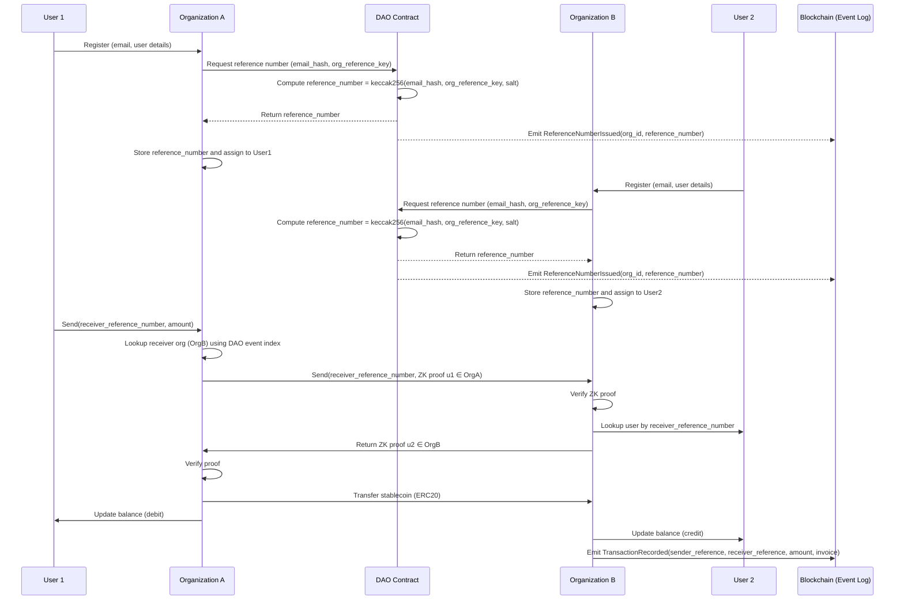

## SC Fraud Detection Service Diagram.
```
sequenceDiagram
    participant User as User/Client
    participant API as FastAPI API
    participant Alchemy as Alchemy API
    participant FE as Feature Extractor
    participant OS as OpenSearch (Vector DB)
    participant KNN as K-NN Service
    participant RAG as RAG Service (Gemini)
    participant BC as Blockchain (Ethereum)
    
    User->>API: POST /score (address)
    API->>Alchemy: Request transaction history
    Alchemy->>BC: Query sent transactions
    BC-->>Alchemy: Return sent transactions
    Alchemy->>BC: Query received transactions
    BC-->>Alchemy: Return received transactions
    Alchemy->>BC: Query balance & token data
    BC-->>Alchemy: Return balance & tokens
    Alchemy-->>API: Return complete account data
    
    API->>FE: Extract features from raw data
    FE->>FE: Calculate 44-dimensional vector<br/>(tx metrics, timing, values, ERC20)
    FE-->>API: Return normalized feature vector
    
    API->>OS: K-NN search (vector, k=10)
    OS->>OS: HNSW similarity search<br/>(L2 distance)
    OS-->>API: Return 10 nearest neighbors
    
    API->>KNN: Analyze neighbors
    KNN->>KNN: Calculate weighted fraud probability<br/>Calculate confidence score
    KNN-->>API: Return K-NN analysis
    
    API->>RAG: Request RAG analysis
    RAG->>RAG: Node 1: Analyze K-NN results (Gemini)
    RAG->>RAG: Node 2: Detect edge cases<br/>(volume/balance, timing, ERC20)
    RAG->>RAG: Node 3: Final decision (Gemini)
    RAG-->>API: Return final decision + reasoning
    
    API->>API: Combine K-NN + RAG results<br/>Determine final classification
    API-->>User: Return JSON response<br/>(result, probability, confidence, reasoning)
```