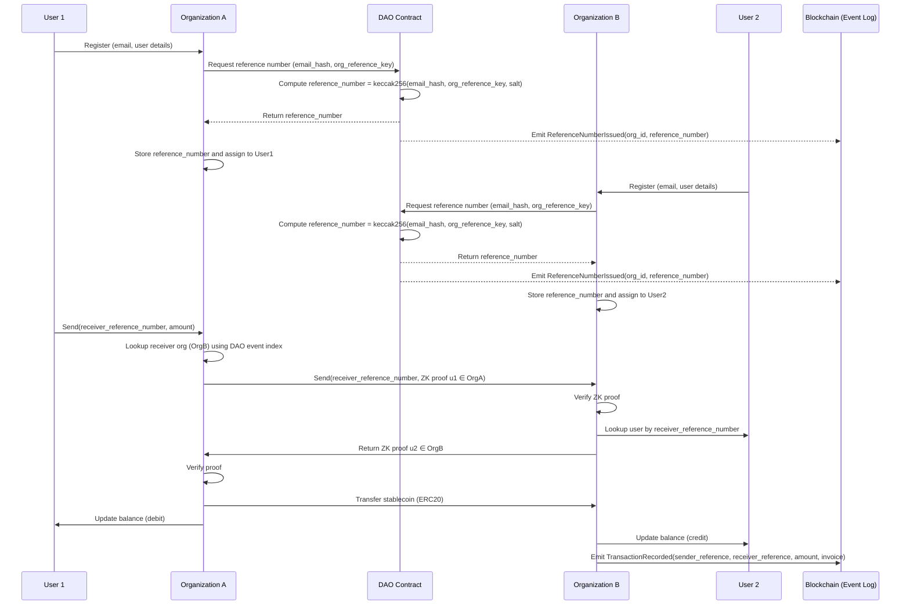

```mermaid
sequenceDiagram
    participant User1 as User 1
    participant OrgA as Organization A
    participant DAO as DAO Contract
    participant OrgB as Organization B
    participant User2 as User 2
    participant Blockchain as Blockchain (Event Log)
    User1->>OrgA: Register (email, user details)
    OrgA->>DAO: Request reference number (email_hash, org_reference_key)
    DAO->>DAO: Compute reference_number = keccak256(email_hash, org_reference_key, salt)
    DAO-->>OrgA: Return reference_number
    DAO-->>Blockchain: Emit ReferenceNumberIssued(org_id, reference_number)
    OrgA->>OrgA: Store reference_number and assign to User1
    User2->>OrgB: Register (email, user details)
    OrgB->>DAO: Request reference number (email_hash, org_reference_key)
    DAO->>DAO: Compute reference_number = keccak256(email_hash, org_reference_key, salt)
    DAO-->>OrgB: Return reference_number
    DAO-->>Blockchain: Emit ReferenceNumberIssued(org_id, reference_number)
    OrgB->>OrgB: Store reference_number and assign to User2
    User1->>OrgA: Send(receiver_reference_number, amount)
    OrgA->>OrgA: Lookup receiver org (OrgB) using DAO event index
    OrgA->>OrgB: Send(receiver_reference_number, ZK proof u1 ∈ OrgA)
    OrgB->>OrgB: Verify ZK proof
    OrgB->>User2: Lookup user by receiver_reference_number
    OrgB->>OrgA: Return ZK proof u2 ∈ OrgB
    OrgA->>OrgA: Verify proof
    OrgA->>OrgB: Transfer stablecoin (ERC20)
    OrgA->>User1: Update balance (debit)
    OrgB->>User2: Update balance (credit)
    OrgB->>Blockchain: Emit TransactionRecorded(sender_reference, receiver_reference, amount, invoice)
```
