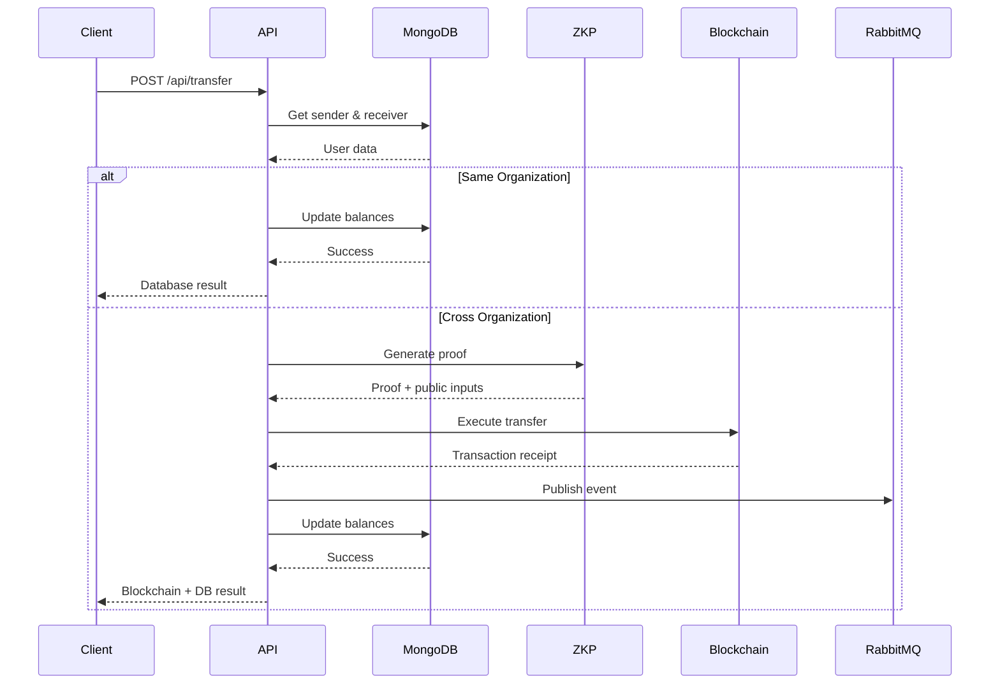

# FinCube B2B Membership Backend - Project Context

## Table of Contents

1. [Overview](#overview)
2. [System Architecture](#system-architecture)
3. [Core Components](#core-components)
4. [Transfer Flow](#transfer-flow)
5. [Zero-Knowledge Proof System](#zero-knowledge-proof-system)
6. [Smart Contracts](#smart-contracts)
7. [Database Schema](#database-schema)
8. [RabbitMQ Integration](#rabbitmq-integration)
9. [API Endpoints](#api-endpoints)
10. [Configuration](#configuration)
11. [Development Workflow](#development-workflow)
12. [Testing](#testing)
13. [Deployment](#deployment)

---

## Overview

The FinCube B2B Membership Backend is a sophisticated system that enables secure, privacy-preserving transfers between organizations using Zero-Knowledge Proofs (ZKP) and blockchain technology. The system supports both same-organization and cross-organization transfers with different security and efficiency characteristics.

**🔌 Plug-and-Play EVM Compatibility**: FinCube is designed to work seamlessly with **any EVM-compatible blockchain**. Simply deploy the smart contracts to your preferred network, configure your RPC endpoint, and you're ready to go. No code changes required to switch between Ethereum, Polygon, Arbitrum, Optimism, BSC, Avalanche, Celo, Base, or any other EVM chain.

### Key Features

- **Zero-Knowledge Proof Generation**: Generates ZKP proofs for user membership verification without revealing sensitive information
- **Blockchain Integration**: Executes on-chain transfers via FinCube smart contracts on Celo network
- **Stablecoin Transfers**: Currently uses USDC for stable-value B2B transactions
- **Dual Transfer Modes**: 
  - Same-organization transfers (database-only, fast)
  - Cross-organization transfers (blockchain + ZKP, secure)
- **Event-Driven Architecture**: Publishes transaction receipts to RabbitMQ for audit trail
- **MongoDB Integration**: Stores user, organization, and batch data
- **Dynamic Token Support**: Automatically detects and handles ERC20 token decimals

### Technology Stack

- **Runtime**: Node.js
- **Framework**: Express.js
- **Database**: MongoDB with Mongoose ODM
- **Blockchain**: Ethers.js + RPC Provider (EVM-compatible chains)
- **Message Queue**: RabbitMQ (AMQP)
- **ZKP**: Noir + Barretenberg (Honk proof system)
- **Cryptography**: Poseidon2 hashing

---

## System Architecture

```
┌─────────────────────────────────────────────────────────────────┐
│                         Client Application                       │
└────────────────────────────┬────────────────────────────────────┘
                             │
                             ▼
┌─────────────────────────────────────────────────────────────────┐
│                    Express.js API Server                         │
│  ┌──────────────┐  ┌──────────────┐  ┌──────────────┐         │
│  │   Transfer   │  │    Proof     │  │    Query     │         │
│  │  Controller  │  │  Controller  │  │  Controller  │         │
│  └──────────────┘  └──────────────┘  └──────────────┘         │
└────────────────────────────┬────────────────────────────────────┘
                             │
        ┌────────────────────┼────────────────────┐
        │                    │                    │
        ▼                    ▼                    ▼
┌──────────────┐    ┌──────────────┐    ┌──────────────┐
│   MongoDB    │    │  Blockchain  │    │   RabbitMQ   │
│              │    │   (Celo)     │    │              │
│ - Users      │    │ - FinCube    │    │ - Tx Events  │
│ - Orgs       │    │ - Verifier   │    │ - Audit      │
│ - Batches    │    │ - ERC20      │    │              │
└──────────────┘    └──────────────┘    └──────────────┘
```

### Component Interaction Flow

1. **Client** → API Server (HTTP/JSON)
2. **API Server** → MongoDB (User/Org data)
3. **API Server** → Blockchain (Smart contract calls)
4. **API Server** → RabbitMQ (Event publishing)
5. **RabbitMQ** → Audit Trail Service (Event consumption)

---

## Core Components

### 1. Controllers

#### Transfer Controller (`controllers/transfer-controller.js`)
Orchestrates the complete transfer workflow including:
- Input validation
- User data retrieval
- ZKP proof generation
- Nullifier generation
- Memo creation
- Blockchain transaction execution
- RabbitMQ event publishing
- Database balance updates

#### Proof Controller (`controllers/proof-controller.js`)
Manages ZKP proof lifecycle:
- Test data generation
- Circuit compilation (Noir)
- Witness generation
- Proof generation (Barretenberg)
- On-chain verification

#### Query Controller (`controllers/query-controller.js`)
Provides data retrieval endpoints:
- Get user by ID (with populated batch and organization)
- Get organization by ID (with all associated users)

### 2. Services

#### Transfer Service (`services/transfer-service.js`)
Core business logic for transfers:
- Database balance updates (with optimistic locking)
- Blockchain transfer execution
- Token balance and allowance checking
- Dynamic decimal handling

#### User Management Service (`services/user-management-service.js`)
User and organization data management:
- User CRUD operations
- Organization lookup by reference number
- Batch management

### 3. Models

#### User Model (`models/user.js`)
```javascript
{
  user_id: Number (unique, required),
  batch_id: ObjectId (ref: Batch),
  balance: Number (default: 0, min: 0),
  reference_number: String (unique, sparse),
  zkp_key: String (unique, required),
  createdAt: Date,
  updatedAt: Date
}
```

#### Organization Model (`models/organization.js`)
```javascript
{
  org_id: Number (unique, required),
  wallet_address: String (unique, required),
  org_salt: String (unique, auto-generated),
  createdAt: Date,
  updatedAt: Date
}
```

#### Batch Model (`models/batch.js`)
```javascript
{
  equation: [String] (polynomial coefficients as BigInt strings),
  createdAt: Date,
  updatedAt: Date
}
```

### 4. Utilities

- **RabbitMQ Publisher** (`utils/rabbitmq-publisher.js`): Transaction event publishing
- **RabbitMQ Consumer** (`utils/rabbitmq-consumer.js`): Event consumption from UMS
- **Connection Manager** (`utils/rabbitmq-connection-manager.js`): RabbitMQ lifecycle
- **Event Handlers** (`utils/event-handlers.js`): User event processing
- **Logger** (`utils/logger.js`): Structured logging

---

## Transfer Flow

### Same-Organization Transfer

When sender and receiver belong to the same organization:

```
1. Validate Input
2. Retrieve User Data
3. Check Organization Match ✓
4. Update Database Balances
5. Return Success
```

**Characteristics:**
- No blockchain transaction
- No ZKP proof generation
- Fast execution (~100ms)
- No gas costs
- Database-only operation

### Cross-Organization Transfer

When sender and receiver belong to different organizations:

```
1. [STEP 1/7] Validate Input
2. [STEP 2/7] Retrieve User Data
3. [STEP 3/7] Generate ZKP Proof (receiver membership)
4. [STEP 4/7] Generate Nullifier (unique tx ID)
5. [STEP 5/7] Create Memo (transfer metadata)
6. [STEP 6/7] Execute Blockchain Transfer
7. [STEP 7/7] Publish to RabbitMQ
8. [STEP 8/7] Update Database Balances
```

**Characteristics:**
- Full blockchain transaction
- ZKP proof for receiver verification
- Event publishing for audit trail
- Slower execution (~5-10s)
- Gas costs apply
- Cryptographically secure

### Transfer Sequence Diagram



---

## Zero-Knowledge Proof System

### Overview

The system uses Noir (a domain-specific language for ZKP) and Barretenberg (a proving backend) to generate Honk proofs that verify user membership in an organization without revealing sensitive information.

### Circuit Logic (`backend/base/circuit/src/main.nr`)

The circuit proves:
1. User knows a secret derived from their email and organization salt
2. User's secret evaluates to zero on the organization's polynomial
3. User is KYC verified (optional constraint)

### Proof Generation Workflow

```
1. Test Data Generation
   ├─ Polynomial coefficients (from batch)
   ├─ User secret (from zkp_key + org_salt)
   ├─ Verifier key (from wallet_address)
   └─ Nullifier (from secret + verifier_key)

2. Circuit Compilation
   └─ nargo compile → bytecode

3. Witness Generation
   └─ nargo execute → witness file

4. Proof Generation
   └─ bb prove → proof + public inputs

5. Verification (optional)
   └─ bb verify OR on-chain verification
```

### Cryptographic Components

- **Poseidon2 Hash**: Used for polynomial hashing and secret generation
- **BN254 Curve**: Elliptic curve for ZKP operations
- **Field Prime**: 21888242871839275222246405745257275088548364400416034343698204186575808495617
- **Polynomial Degree**: 128 (MAX_POLY_DEGREE)

### Public Inputs

The proof includes public inputs that are verified on-chain:
1. Polynomial hash (commitment to organization's member set)
2. Nullifier (prevents double-spending)
3. Verifier key (links to organization's wallet)

---

## Smart Contracts

### FinCube Contract

**Current Deployment**: `0x3688ed8BBf990Ea42Eb55aC0b133a03d5D8827e1` (Example: Celo Sepolia testnet)

**EVM Compatibility**: The FinCube contract is fully compatible with any EVM-based blockchain. Deploy to your preferred network by updating the contract address and RPC endpoint in your configuration.

**Key Functions**:
```solidity
function safeTransfer(
    address to,
    uint256 amount,
    string calldata memo,
    bytes32 nullifier,
    bytes32 sender_reference_number,
    bytes32 receiver_reference_number,
    bytes calldata receiver_proof,
    bytes32[] calldata receiver_publicInputs
) external
```

**Features**:
- Verifies receiver's ZKP proof
- Checks nullifier uniqueness
- Transfers ERC20 tokens
- Emits transfer events

### HonkVerifier Contract

**Current Deployment**: `0x4f6d3955E842Ee88B44f87c9A043baCecf24c097` (Example: Celo Sepolia testnet)

**EVM Compatibility**: The HonkVerifier contract works on any EVM-compatible blockchain. Simply deploy to your target network and update the configuration.

**Key Functions**:
```solidity
function verify(
    bytes calldata proof,
    bytes32[] calldata publicInputs
) external view returns (bool)
```

**Features**:
- Verifies Honk ZKP proofs
- Returns boolean verification result
- View function (no gas for calls)

### ERC20 Token

The system supports any ERC20 token approved by the FinCube contract. Token decimals are automatically detected and handled.

**Current Implementation**: The project currently uses **USDC (USD Coin)** for transfers. The system is EVM-compatible and works with any ERC20 token on any EVM-based blockchain.

**Recommended Token Types**: For production deployments, we strongly recommend using **stablecoins** such as:
- **USDC** (USD Coin) - Currently implemented
- **USDT** (Tether)
- **DAI** (Dai Stablecoin)
- **cUSD** (Celo Dollar) - Native to Celo ecosystem

**Why Stablecoins?**
- **Price Stability**: Maintains consistent value (~$1 USD), reducing volatility risk
- **Predictable Accounting**: Simplifies financial reporting and reconciliation
- **User Experience**: Users know exact transfer values without price fluctuation concerns
- **Business Operations**: Ideal for B2B transactions requiring stable value transfers
- **Cross-Border Transfers**: Facilitates international payments without currency conversion complexity

---

## Database Schema

### Collections

#### users
- Primary Key: `_id` (ObjectId)
- Unique Keys: `user_id`, `zkp_key`, `reference_number` (sparse)
- Foreign Keys: `batch_id` → batches
- Indexes: All unique fields

#### organizations
- Primary Key: `_id` (ObjectId)
- Unique Keys: `org_id`, `wallet_address`, `org_salt`
- Indexes: All unique fields

#### batches
- Primary Key: `_id` (ObjectId)
- No unique constraints
- Stores polynomial coefficients as string arrays

### Relationships

```
Organization (1) ←→ (N) User
     ↓
  org_salt = user.reference_number
  
Batch (1) ←→ (N) User
     ↓
  batch_id (FK)
```

### Reference Number Format

User reference numbers contain the organization's wallet address:
```
Format: <prefix>_<wallet_address>_<suffix>
Example: REF_0x1234...5678_USER_001
```

This allows efficient lookup of users by organization.

---

## RabbitMQ Integration

### Architecture

```
┌─────────────────────────────────────────────────────────┐
│                    RabbitMQ Broker                       │
│                                                          │
│  ┌────────────────────────────────────────────────┐    │
│  │  exchange.transaction-receipt.fanout           │    │
│  │  (Fanout Exchange)                             │    │
│  └────────────┬───────────────────────────────────┘    │
│               │                                          │
│               ├─→ audit-trail-queue                     │
│               ├─→ analytics-queue                       │
│               └─→ compliance-queue                      │
└─────────────────────────────────────────────────────────┘
```

### Transaction Receipt Event

Published after every successful cross-organization blockchain transfer:

```json
{
  "onChainData": {
    "transactionHash": "0x...",
    "signedBy": "0x...",
    "chainId": "44787",
    "context": {
      "fromUserId": 2001,
      "toUserId": 2002,
      "amount": 0.01,
      "senderWalletAddress": "0x...",
      "receiverWalletAddress": "0x...",
      "blockNumber": 12345,
      "gasUsed": "150000",
      "memo": "{...}",
      "nullifier": "0x..."
    }
  },
  "timestamp": "2024-01-01T00:00:00.000Z"
}
```

### Consumer Services

External services can consume these events for:
- **Audit Trail**: Permanent transaction logging
- **Analytics**: Transaction pattern analysis
- **Compliance**: Regulatory reporting
- **Monitoring**: Real-time alerts

### Configuration

- **Exchange**: `exchange.transaction-receipt.fanout` (configurable)
- **Type**: Fanout (broadcasts to all queues)
- **Durable**: Yes
- **Non-Blocking**: Publishing failures don't affect transactions

---

## API Endpoints

### Transfer Endpoints

#### POST /api/transfer
Execute a ZKP-enabled transfer

**Request**:
```json
{
  "receiver_reference_number": "string",
  "amount": number,
  "sender_user_id": number
}
```

**Response** (Cross-Org):
```json
{
  "success": true,
  "blockchain": { /* transaction details */ },
  "database": { /* balance updates */ }
}
```

**Response** (Same-Org):
```json
{
  "success": true,
  "transferType": "SAME_ORGANIZATION",
  "database": { /* balance updates */ }
}
```

### Query Endpoints

#### GET /api/query/user/:user_id
Retrieve user with populated batch and organization

#### GET /api/query/organization/:org_id
Retrieve organization with all associated users

### Proof Endpoints

#### POST /api/proof/generate
Generate a ZKP proof

**Request**:
```json
{
  "testConfig": {
    "roots": ["123", "456", "789"],
    "userEmail": "test@example.com",
    "salt": "test_salt",
    "verifierKey": "key",
    "isKYCed": true
  }
}
```

#### POST /api/proof/verify
Verify a proof against the on-chain contract

**Request**:
```json
{
  "proof": "0x...",
  "publicInputs": ["0x...", "0x..."]
}
```

### Health Check

#### GET /health
Server and service status

**Response**:
```json
{
  "status": "ok",
  "service": "zkp-proof-controller",
  "database": "connected",
  "rabbitmq": {
    "consumer": "connected",
    "publisher": "connected"
  }
}
```

---

## Configuration

### Environment Variables

```env
# RPC Provider Configuration (Alchemy, Infura, or any RPC endpoint)
ALCHEMY_API_KEY=your_api_key
ALCHEMY_NETWORK=your-network-name
ALCHEMY_URL=https://your-network.g.alchemy.com/v2/your_api_key
# Or use any EVM-compatible RPC endpoint:
# ALCHEMY_URL=https://mainnet.infura.io/v3/your_key
# ALCHEMY_URL=https://polygon-rpc.com
# ALCHEMY_URL=https://arb1.arbitrum.io/rpc

# Smart Contract Configuration
HONK_VERIFIER_CONTRACT_ADDRESS=0x...
FINCUBE_CONTRACT_ADDRESS=0x...

# Wallet Configuration
WALLET_PRIVATE_KEY=your_private_key

# Server Configuration
PORT=7000

# MongoDB Configuration
MONGODB_URI=mongodb://localhost:27017/b2b-membership
MONGODB_DB_NAME=b2b-membership

# RabbitMQ Configuration
RABBITMQ_HOST=localhost
RABBITMQ_PORT=5672
RABBITMQ_USERNAME=guest
RABBITMQ_PASSWORD=guest
RABBITMQ_EXCHANGE=exchange.ums.events
RABBITMQ_EXCHANGE_TYPE=topic
RABBITMQ_TRANSACTION_RECEIPT_EXCHANGE=exchange.transaction-receipt.fanout

# Chain ID (automatically detected from RPC, or manually specify)
CHAIN_ID=1  # Ethereum Mainnet
# Examples: 1 (Ethereum), 137 (Polygon), 42161 (Arbitrum), 10 (Optimism), 56 (BSC), etc.
```

### Network Configuration

**EVM Compatibility**: FinCube is a **plug-and-play solution** that works with any EVM-compatible blockchain. Simply configure your RPC endpoint and deploy the smart contracts to your preferred network.

**Supported Networks** (Examples):
- **Ethereum**: Mainnet, Sepolia, Goerli
- **Polygon**: Mainnet, Mumbai
- **Arbitrum**: One, Goerli
- **Optimism**: Mainnet, Goerli
- **Avalanche**: C-Chain, Fuji
- **BSC**: Mainnet, Testnet
- **Celo**: Mainnet, Alfajores, Sepolia
- **Base**: Mainnet, Goerli
- **Any EVM-compatible chain**: The system adapts automatically

**Configuration**: Update `ALCHEMY_URL` (or any RPC provider) and `CHAIN_ID` in your `.env` file to switch networks.

### Token Configuration

**Current Token**: USDC (USD Coin)

The FinCube contract must be configured with an approved ERC20 token address. The system currently uses USDC for the following reasons:

1. **Stability**: Maintains 1:1 peg with USD
2. **Liquidity**: High liquidity across multiple networks
3. **Adoption**: Widely accepted stablecoin
4. **Transparency**: Regular attestations and audits

**EVM Compatibility**: The system works with **any ERC20 token** on **any EVM-compatible blockchain**. Token decimals are automatically detected and handled.

**Configuring Alternative Tokens**:

To use a different token on any EVM chain:
1. Deploy or identify the token contract address on your target network
2. Update the FinCube contract's approved token
3. Ensure sufficient liquidity for the token
4. Update your `.env` configuration

**Recommended Stablecoins** (Available on most EVM chains):
- **USDC**: USD Coin (current implementation)
- **USDT**: Tether
- **DAI**: Multi-collateral stablecoin
- **Network-specific stablecoins**: cUSD (Celo), BUSD (BSC), etc.

---

## Development Workflow

### Setup

```bash
# 1. Install dependencies
npm install

# 2. Configure environment
cp .env.example .env
# Edit .env with your configuration

# 3. Start MongoDB
docker-compose up -d

# 4. Start server
npm start
```

### Testing Transfers

```bash
# 1. Check token balance
node check-token-balance.js

# 2. Approve FinCube contract
node approve-fincube.js 1000

# 3. Test query endpoints
node test-query-api.js 2001 1001

# 4. Execute transfer via API
curl -X POST http://localhost:7000/api/transfer \
  -H "Content-Type: application/json" \
  -d '{
    "receiver_reference_number": "REF_0x..._USER_002",
    "amount": 0.01,
    "sender_user_id": 2001
  }'
```

### Testing RabbitMQ

```bash
# Test publisher
node test-rabbitmq-publisher.js

# Check health
curl http://localhost:7000/health
```

### Accessing MongoDB

```bash
# Via Mongo Express (Web UI)
# URL: http://localhost:8081
# Username: admin
# Password: admin123

# Via CLI
mongo mongodb://localhost:27017/b2b-membership
```

---

## Testing

### Test Files

- `test-models.js` - Database model validation
- `test-database-connection.js` - MongoDB connection tests
- `test-app-startup.js` - Application lifecycle tests
- `test-query-api.js` - Query endpoint tests
- `test-api-with-config.js` - Proof generation tests
- `test-verify-api.js` - Proof verification tests
- `test-rabbitmq-publisher.js` - RabbitMQ publishing tests
- `test-blockchain-integration.js` - Blockchain integration tests
- `test-proof-service-unit.js` - ZKP service unit tests

### Running Tests

```bash
# Run all tests
node run-all-tests.js

# Run specific test
node test-models.js
```

### Test Coverage

- ✅ Database models and constraints
- ✅ Transfer workflows (same-org and cross-org)
- ✅ ZKP proof generation and verification
- ✅ Blockchain integration
- ✅ RabbitMQ event publishing
- ✅ API endpoints
- ✅ Error handling

---

## Deployment

### EVM Chain Deployment

**FinCube is EVM-agnostic** and can be deployed to any EVM-compatible blockchain without code modifications. The system automatically adapts to different networks.

**Steps to Deploy on Any EVM Chain**:

1. **Choose Your Network**: Select any EVM-compatible blockchain (Ethereum, Polygon, Arbitrum, etc.)

2. **Deploy Smart Contracts**: Deploy FinCube and HonkVerifier contracts to your chosen network using standard deployment tools (Hardhat, Foundry, Remix)

3. **Configure RPC Endpoint**: Update `.env` with your network's RPC URL:
   ```env
   ALCHEMY_URL=https://your-network-rpc-endpoint
   CHAIN_ID=your_chain_id
   ```

4. **Update Contract Addresses**: Set the deployed contract addresses in `.env`:
   ```env
   FINCUBE_CONTRACT_ADDRESS=0x...
   HONK_VERIFIER_CONTRACT_ADDRESS=0x...
   ```

5. **Configure Token**: Set the ERC20 token address for your network

6. **Start Application**: The system automatically detects network parameters and token decimals

**No Code Changes Required**: The same codebase works across all EVM chains!

### Prerequisites

1. **MongoDB**: Running instance or MongoDB Atlas
2. **RabbitMQ**: Running instance on `fincube23_network`
3. **RPC Provider**: API key for your chosen EVM network (Alchemy, Infura, or public RPC)
4. **Wallet**: Private key with sufficient native tokens for gas (ETH, MATIC, AVAX, etc.)
5. **Smart Contracts**: Deployed FinCube and HonkVerifier contracts on your target EVM chain

### Deployment Steps

```bash
# 1. Clone repository
git clone <repository-url>
cd backend/b2b-membership

# 2. Install dependencies
npm install

# 3. Configure environment
cp .env.example .env
# Edit .env with production values

# 4. Start services
docker-compose up -d

# 5. Run migrations (if needed)
node migrate-data.js

# 6. Start application
npm start
```

### Production Considerations

1. **Security**:
   - Use environment-specific `.env` files
   - Never commit private keys
   - Use secrets management (AWS Secrets Manager, HashiCorp Vault)
   - Enable HTTPS/TLS

2. **Monitoring**:
   - Set up logging aggregation (ELK, Datadog)
   - Monitor RabbitMQ queue depths
   - Track blockchain transaction failures
   - Alert on database connection issues

3. **Scaling**:
   - Use MongoDB replica sets for high availability
   - Deploy multiple API instances behind load balancer
   - Use RabbitMQ clustering for reliability
   - Consider caching frequently accessed data

4. **Backup**:
   - Regular MongoDB backups
   - Store private keys securely
   - Document contract addresses
   - Backup RabbitMQ configuration

---

## Documentation

### Core Documentation

- `API_USAGE.md` - Complete API reference and usage examples
- `RABBITMQ_TRANSACTION_EVENTS.md` - RabbitMQ integration guide
- `BLOCKCHAIN_INTEGRATION_COMPLETE.md` - Blockchain integration details
- `SCHEMA_MIGRATION_GUIDE.md` - Database migration instructions
- `TROUBLESHOOTING.md` - Common issues and solutions

### Additional Resources

- `README.md` - Quick start guide
- `SESSION_SUMMARY.md` - Development session notes
- `TEST_RESULTS.md` - Test execution results
- `QUICK_START.md` - Getting started guide

---

## Architecture Decisions

### Why Dual Transfer Modes?

- **Same-Organization**: Optimized for speed and cost (no blockchain overhead)
- **Cross-Organization**: Prioritizes security and auditability (blockchain + ZKP)

### Why Zero-Knowledge Proofs?

- Proves membership without revealing user identity
- Enables privacy-preserving transfers
- Prevents unauthorized access to organization data

### Why RabbitMQ?

- Decouples transaction execution from audit logging
- Enables multiple consumers (audit, analytics, compliance)
- Provides reliable message delivery
- Supports event-driven architecture

### Why MongoDB?

- Flexible schema for evolving requirements
- Good performance for read-heavy workloads
- Native support for complex data types (arrays, nested objects)
- Easy horizontal scaling

---

## Future Enhancements

### Planned Features

1. **Multi-Stablecoin Support**: Support multiple stablecoins (USDC, USDT, DAI, cUSD) simultaneously
2. **Batch Transfers**: Execute multiple transfers in a single transaction
3. **Transaction History**: Store complete transfer history in database
4. **Rate Limiting**: Prevent abuse and DoS attacks
5. **Webhook Support**: Push notifications for transfer events
6. **GraphQL API**: Alternative to REST for complex queries
7. **Fraud Detection**: Integration with fraud detection service
8. **Mobile SDK**: Native mobile app support
9. **Fiat On/Off Ramps**: Integration with fiat-to-stablecoin conversion services

### Performance Optimizations

1. **Proof Caching**: Cache generated proofs for reuse
2. **Database Indexing**: Optimize query performance
3. **Connection Pooling**: Reuse database and RabbitMQ connections
4. **Async Processing**: Move heavy operations to background jobs
5. **CDN Integration**: Cache static assets

---

## Support and Maintenance

### Common Issues

1. **Insufficient Balance**: Ensure sender has enough tokens
2. **Insufficient Allowance**: Approve FinCube contract to spend tokens
3. **RabbitMQ Connection**: Verify RabbitMQ is running on correct network
4. **MongoDB Connection**: Check connection string and credentials
5. **Blockchain Errors**: Verify contract addresses and network configuration

### Debugging

```bash
# Check logs
tail -f logs/app.log

# Test blockchain connection
node check-contract.js

# Test token balance
node check-token-balance.js

# Test RabbitMQ
node test-rabbitmq-publisher.js

# Check MongoDB indexes
node check-indexes.js
```

### Getting Help

1. Review documentation in this directory
2. Check `TROUBLESHOOTING.md` for common issues
3. Review test files for usage examples
4. Check application logs for error details

---

## License
MIT


## Version History

- **v1.0.0** - Initial release with core transfer functionality
- **v1.1.0** - Added RabbitMQ integration
- **v1.2.0** - Added query endpoints
- **v1.3.0** - Added dynamic token decimal support

---

**Last Updated**: 2024-01-21
