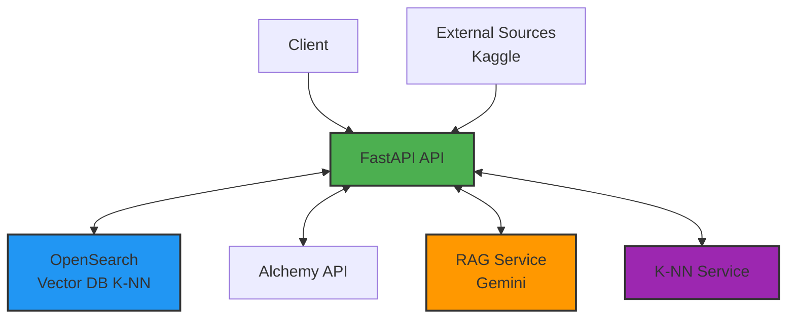

# Architecture Documentation


## System Overview




## Request Flow

### 1. Data Loading Flow

```
User Request
    │
    ▼
POST /scrape
    │
    ├─▶ DataScraper
    │       │
    │       ├─▶ Download from Kaggle/CSV/JSON
    │       │
    │       └─▶ Parse and clean data
    │
    ├─▶ FeatureExtractor
    │       │
    │       └─▶ Convert to 44-dim vectors
    │
    └─▶ OpenSearchService
            │
            └─▶ Bulk insert into vector DB
```

### 2. Fraud Detection Flow

```
User Request (Address)
    │
    ▼
POST /score
    │
    ├─▶ AlchemyService
    │       │
    │       ├─▶ Get sent transactions
    │       ├─▶ Get received transactions
    │       ├─▶ Get balance
    │       ├─▶ Get token balances
    │       └─▶ Get transaction count
    │
    ├─▶ FeatureExtractor
    │       │
    │       ├─▶ Calculate transaction metrics
    │       ├─▶ Calculate value statistics
    │       ├─▶ Calculate timing patterns
    │       ├─▶ Calculate ERC20 metrics
    │       └─▶ Create 44-dim vector
    │
    ├─▶ OpenSearchService
    │       │
    │       └─▶ K-NN search (find 10 nearest neighbors)
    │
    ├─▶ KNNService
    │       │
    │       ├─▶ Calculate fraud probability
    │       ├─▶ Calculate confidence score
    │       └─▶ Analyze neighbor patterns
    │
    ├─▶ RAGService (LangGraph)
    │       │
    │       ├─▶ Node 1: Analyze K-NN results
    │       │       │
    │       │       └─▶ Gemini analyzes patterns
    │       │
    │       ├─▶ Node 2: Detect edge cases
    │       │       │
    │       │       ├─▶ Check volume/balance ratio
    │       │       ├─▶ Check transaction patterns
    │       │       ├─▶ Check value movements
    │       │       └─▶ Check timing anomalies
    │       │
    │       └─▶ Node 3: Final decision
    │               │
    │               └─▶ Gemini makes final call
    │
    └─▶ Response
            │
            └─▶ JSON with result, reasoning, confidence
```

## Component Details

### 1. Data Scraper

**Purpose**: Load training data from various sources

**Supported Sources**:
- Kaggle datasets (via Kaggle API)
- CSV files (via HTTP)
- JSON APIs (via HTTP)

**Process**:
1. Authenticate with source
2. Download data
3. Parse into records
4. Return list of dictionaries

### 2. Alchemy Service

**Purpose**: Fetch real-time Ethereum account data

**API Calls**:
- `alchemy_getAssetTransfers` (sent) - Get outgoing transactions
- `alchemy_getAssetTransfers` (received) - Get incoming transactions
- `eth_getBalance` - Get current balance
- `eth_getTransactionCount` - Get nonce
- `alchemy_getTokenBalances` - Get ERC20 tokens

**Output**: Comprehensive account data dictionary

### 3. Feature Extractor

**Purpose**: Convert raw data to feature vectors

**Features Extracted** (44 total):

**Transaction Metrics**:
- Sent/received transaction counts
- Total transaction count
- Contract creation count

**Timing Metrics**:
- Average time between sent transactions
- Average time between received transactions
- Time range (first to last transaction)

**Value Metrics**:
- Min/max/avg sent values
- Min/max/avg received values
- Total sent/received amounts
- Current balance

**Address Metrics**:
- Unique sent-to addresses
- Unique received-from addresses

**Contract Metrics**:
- Contract transaction counts
- Contract value statistics
- Total sent to contracts

**ERC20 Metrics**:
- ERC20 transaction counts
- ERC20 value statistics
- ERC20 timing patterns
- Unique token counts
- Most common tokens

**Output**: 44-dimensional normalized vector

### 4. OpenSearch Service

**Purpose**: Vector database with K-NN search

**Index Configuration**:
- Algorithm: HNSW (Hierarchical Navigable Small World)
- Space type: L2 (Euclidean distance)
- Dimension: 44
- Engine: nmslib

**Operations**:
- Create index with K-NN settings
- Bulk insert vectors
- K-NN similarity search
- Index statistics

**Performance**:
- Sub-second search for millions of vectors
- Optimized for similarity queries

### 5. K-NN Service

**Purpose**: Analyze nearest neighbors for fraud probability

**Algorithm**:
1. Get k nearest neighbors from OpenSearch
2. Calculate inverse distance weights
3. Compute weighted fraud probability
4. Calculate confidence score
5. Make initial decision

**Confidence Calculation**:
```
distance_confidence = 1 / (1 + avg_distance)
agreement = max(fraud_count, non_fraud_count) / total
confidence = (distance_confidence + agreement) / 2
```

**Decision Logic**:
- confidence < 0.4 → "Undecided"
- fraud_prob >= 0.5 → "True" (Fraud)
- fraud_prob < 0.5 → "False" (Not Fraud)

### 6. RAG Service (LangGraph)

**Purpose**: LLM-enhanced analysis with edge case detection

**Workflow**:

```
┌─────────────────┐
│  Analyze K-NN   │
│   (Gemini)      │
└────────┬────────┘
         │
         ▼
┌─────────────────┐
│ Detect Edge     │
│ Cases           │
└────────┬────────┘
         │
         ▼
┌─────────────────┐
│ Final Decision  │
│   (Gemini)      │
└────────┬────────┘
         │
         ▼
    JSON Output
```

**Node 1: Analyze K-NN**
- Input: K-NN results + features
- Process: Gemini analyzes patterns
- Output: Initial analysis text

**Node 2: Detect Edge Cases**
- Input: Features + K-NN results
- Process: Rule-based detection
- Output: List of edge cases

**Edge Cases Detected**:
1. High volume + low balance
2. Imbalanced transaction ratio
3. Large value movements
4. Rapid activity bursts
5. Low K-NN confidence
6. Heavy ERC20 usage

**Node 3: Final Decision**
- Input: K-NN analysis + edge cases
- Process: Gemini makes final call
- Output: Structured JSON

**Output Format**:
```json
{
  "final_decision": "True|False|Undecided",
  "reasoning": "Detailed explanation",
  "confidence": 0.0-1.0,
  "edge_cases_detected": ["list"],
  "risk_factors": ["list"]
}
```

## Data Models

### Feature Vector Structure

```python
[
  # Transaction counts (4)
  sent_tx, received_tx, total_tx, erc20_tx,
  
  # Timing (3)
  avg_time_sent, avg_time_received, time_range,
  
  # Sent values (4)
  min_sent, max_sent, avg_sent, total_sent,
  
  # Received values (4)
  min_received, max_received, avg_received, total_received,
  
  # Addresses (2)
  unique_sent_to, unique_received_from,
  
  # Contracts (4)
  contract_count, min_contract, max_contract, total_contract,
  
  # Balance (1)
  current_balance,
  
  # ERC20 (22)
  erc20_sent, erc20_received, erc20_min_sent, erc20_max_sent,
  erc20_avg_sent, erc20_min_received, erc20_max_received,
  erc20_avg_received, erc20_unique_sent, erc20_unique_received,
  erc20_contract_sent, erc20_contract_count, erc20_time_sent,
  erc20_time_received, erc20_time_contract, erc20_unique_tokens_sent,
  erc20_unique_tokens_received, erc20_most_sent_count,
  erc20_most_received_count, ...
]
```

### API Response Structure

```json
{
  "result": "Fraud|Not_Fraud|Undecided",
  "address": "0x...",
  "fraud_probability": 0.0-1.0,
  "confidence": 0.0-1.0,
  
  "knn_analysis": {
    "fraud_probability": 0.0-1.0,
    "nearest_neighbors": [
      {
        "address": "0x...",
        "flag": 0|1,
        "distance": 0.0-1.0
      }
    ],
    "avg_distance": 0.0-1.0
  },
  
  "rag_analysis": {
    "reasoning": "string",
    "confidence": 0.0-1.0,
    "edge_cases_detected": ["string"]
  },
  
  "features_extracted": {
    "Sent tnx": number,
    "Received Tnx": number,
    ...
  }
}
```

## Technology Stack

### Backend
- **FastAPI**: Modern async Python web framework
- **Pydantic**: Data validation and settings
- **httpx**: Async HTTP client

### AI/ML
- **LangChain**: LLM framework
- **LangGraph**: Workflow orchestration
- **Google Gemini**: LLM for analysis
- **scikit-learn**: Feature normalization

### Database
- **OpenSearch**: Vector database
- **HNSW**: K-NN algorithm

### Data Processing
- **pandas**: Data manipulation
- **numpy**: Numerical operations

### Infrastructure
- **Docker**: Containerization
- **Docker Compose**: Orchestration

## Performance Characteristics

### Latency Breakdown

```
Total: 5-15 seconds
├─ Alchemy API: 2-5s (40%)
├─ Feature Extraction: <1s (5%)
├─ K-NN Search: <1s (5%)
└─ RAG Analysis: 2-8s (50%)
```

### Scalability

**Vertical Scaling**:
- OpenSearch memory: 512MB → 4GB
- API workers: 1 → 4
- Expected improvement: 2-4x throughput

**Horizontal Scaling**:
- Multiple API instances behind load balancer
- OpenSearch cluster (3+ nodes)
- Expected improvement: Linear with nodes

### Bottlenecks

1. **Alchemy API**: Rate limited (300 CU/s)
2. **Gemini API**: Rate limited (60 req/min)
3. **Network I/O**: External API calls

**Mitigation**:
- Caching for repeated addresses
- Batch processing
- Request queuing

## Security Considerations

### API Security
- Add authentication (API keys)
- Rate limiting per client
- Input validation (address format)
- CORS configuration

### Data Security
- No PII stored
- Addresses are public blockchain data
- API keys in environment variables
- No sensitive data in logs

### Infrastructure Security
- OpenSearch: Disable in production or add auth
- Docker: Use non-root users
- Network: Isolate services
- SSL/TLS: Use reverse proxy

## Monitoring & Observability

### Metrics to Track
- Request latency (p50, p95, p99)
- Error rate
- K-NN search time
- Alchemy API response time
- Gemini API response time
- Database size
- Cache hit rate

### Logging
- Request/response logging
- Error logging with stack traces
- Performance logging
- Audit logging (who checked what)

### Alerting
- High error rate
- Slow response times
- API quota exceeded
- Database full
- Service down

## Future Enhancements

### Short-term
1. Response caching
2. Batch API endpoint
3. Webhook notifications
4. Historical tracking

### Medium-term
1. Custom ML model training
2. Multi-chain support
3. Real-time monitoring
4. Web dashboard

### Long-term
1. Federated learning
2. Graph analysis
3. Behavioral patterns
4. Predictive analytics
