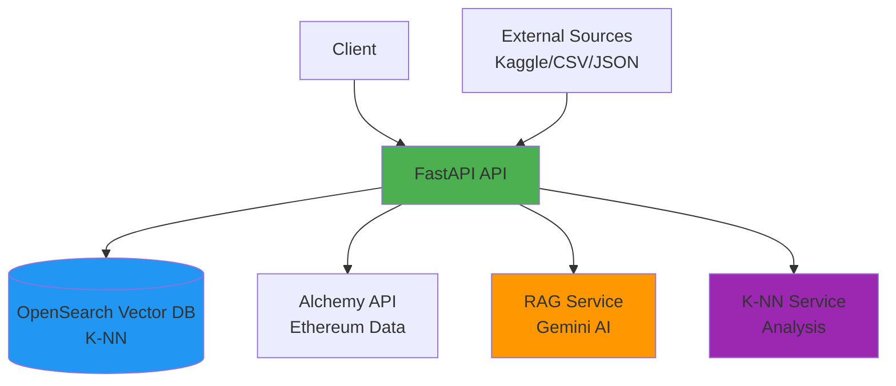
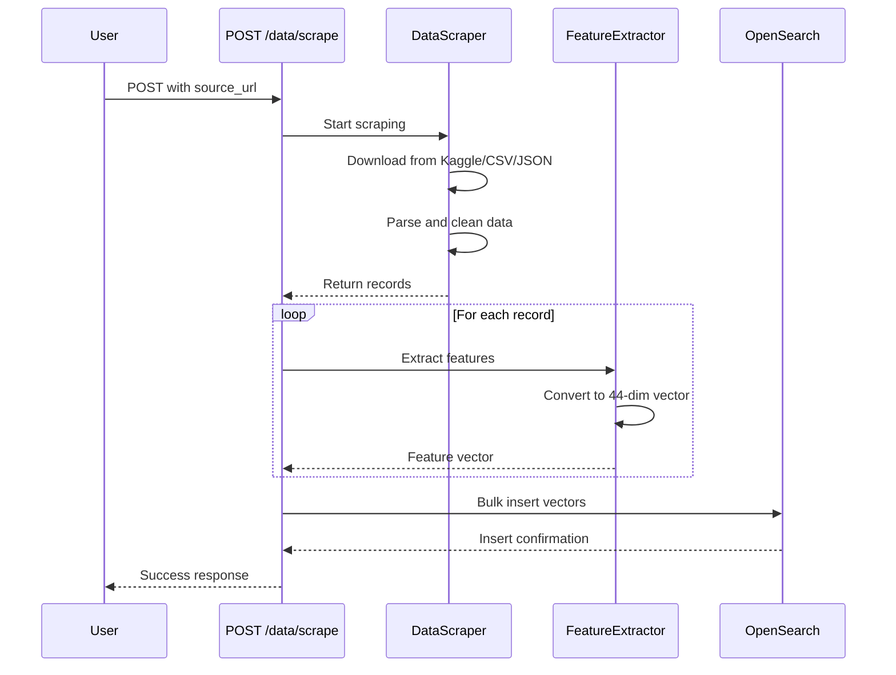
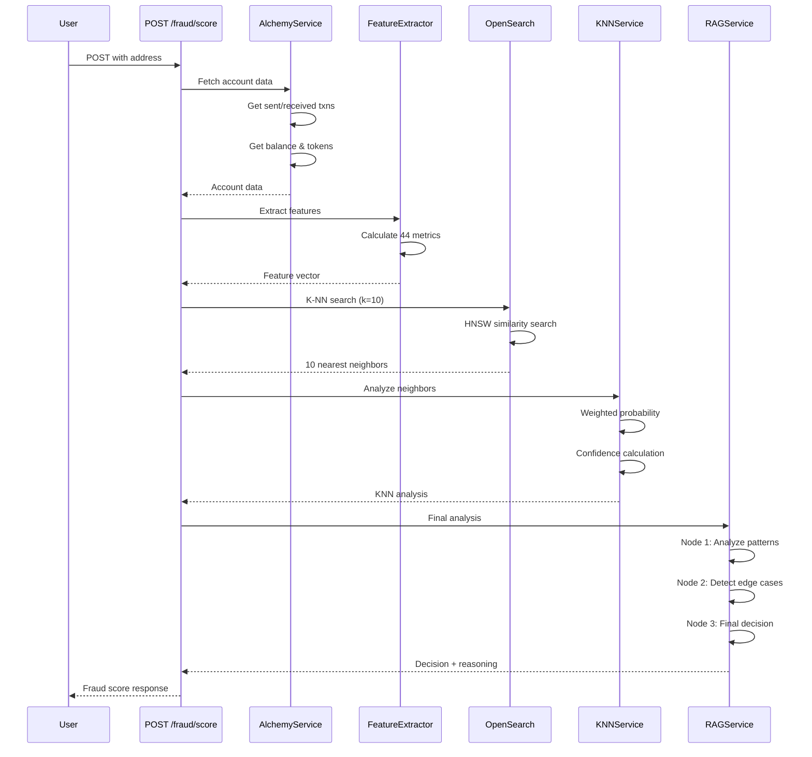
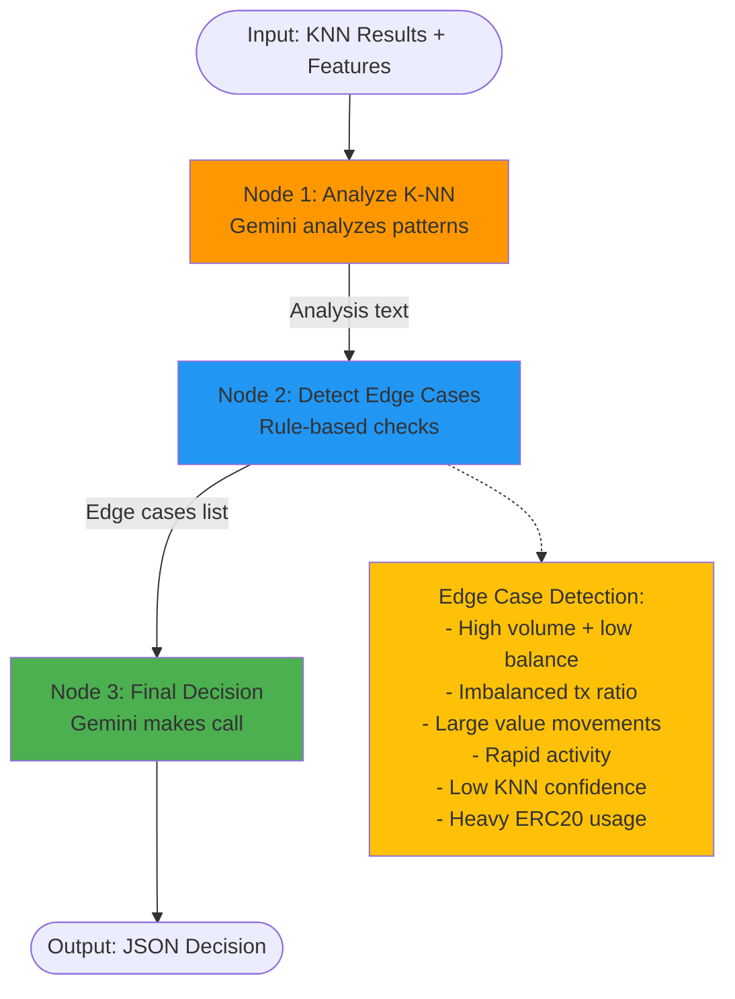
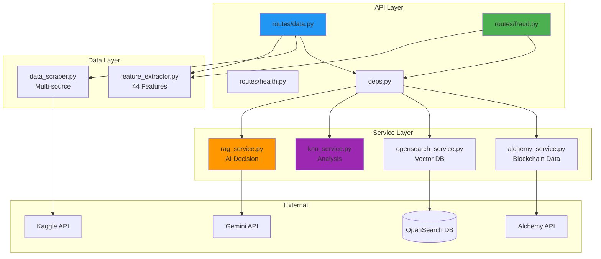
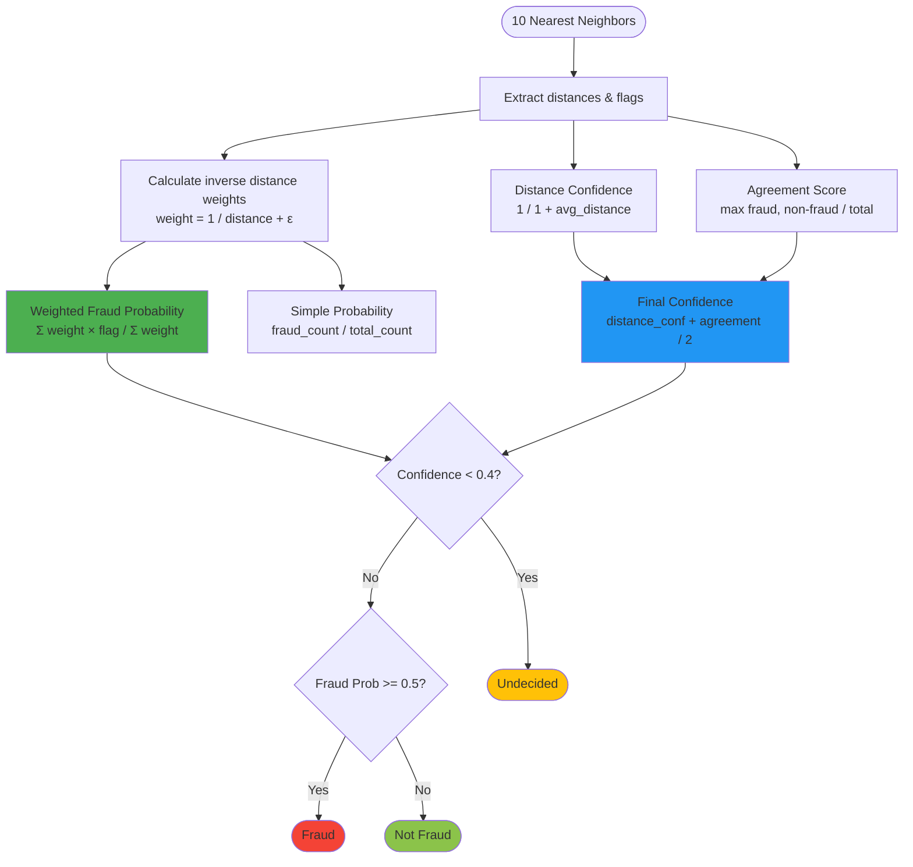
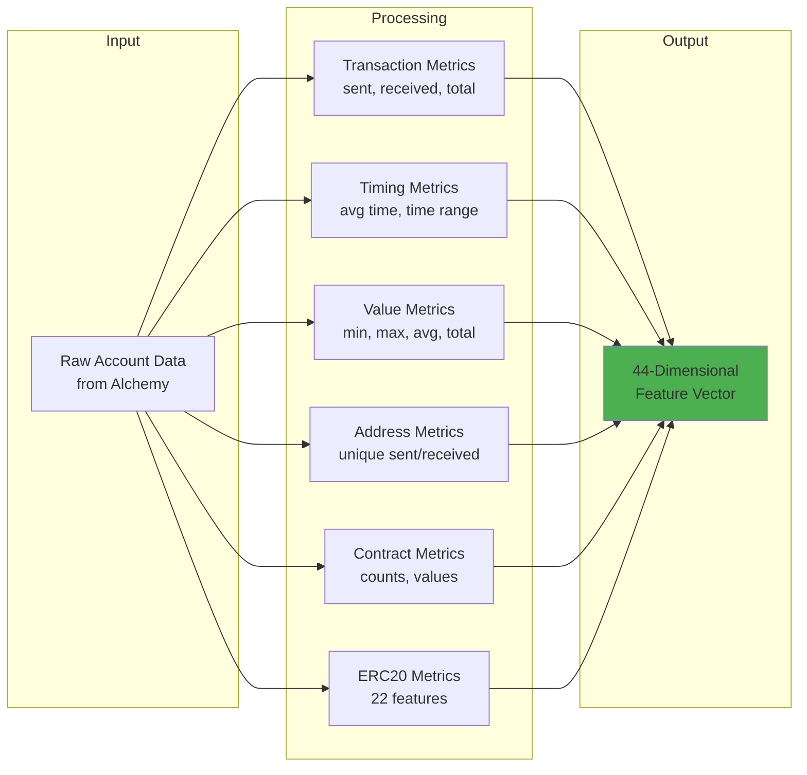
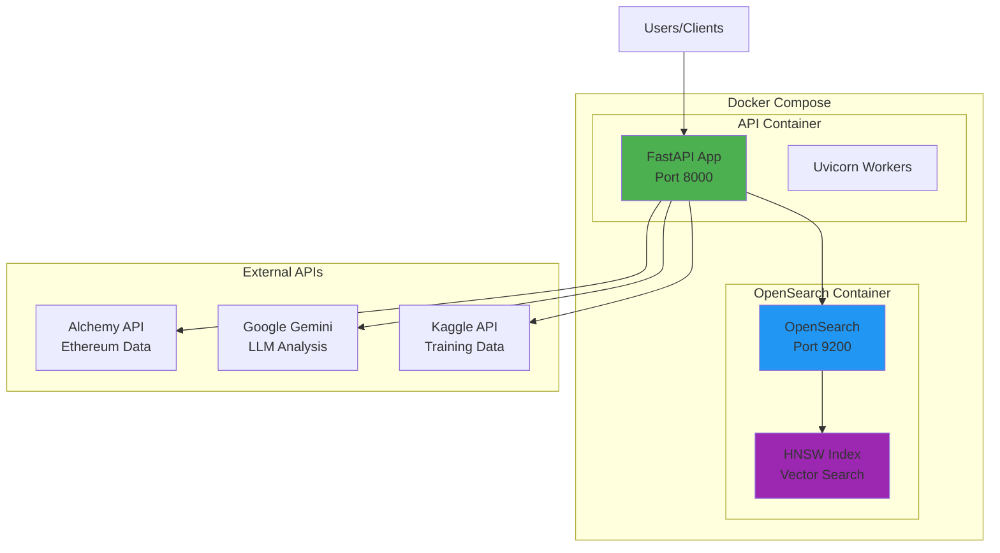

# Architecture Diagrams (Mermaid)

## System Overview

## Data Loading Flow

## Fraud Detection Flow

## RAG Service Workflow (LangGraph)

## Component Architecture

## K-NN Service Algorithm Flow

## Feature Extraction Pipeline

## Deployment Architecture

## Data Flow Summary

```mermaid
graph LR
    A[User Address] --> B[Alchemy API]
    B --> C[Raw Account Data]
    C --> D[Feature Extractor]
    D --> E[44-D Vector]
    E --> F[OpenSearch K-NN]
    F --> G[10 Nearest Neighbors]
    G --> H[KNN Service]
    H --> I[Fraud Probability]
    I --> J[RAG Service]
    J --> K[Final Decision]
    
    style E fill:#4CAF50
    style G fill:#2196F3
    style I fill:#9C27B0
    style K fill:#FF9800
```

